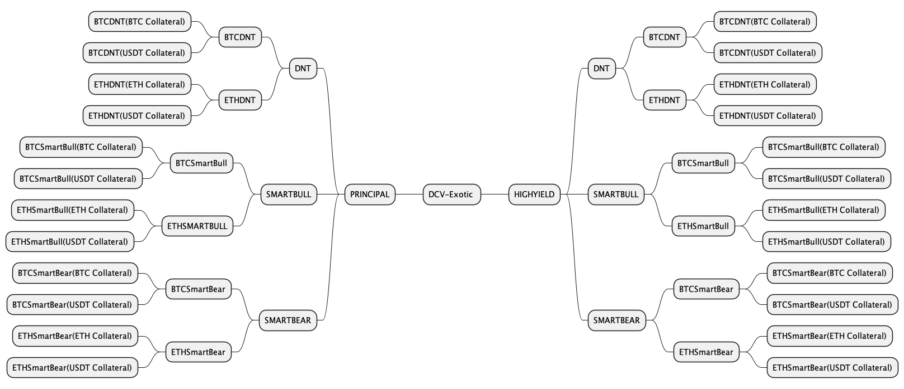

# Vault Classification

The DCV-Exotic protocol is designed with the flexibility **to support any structured product type and collateral denomination**, though a distinction will be made on whether the underlying product contains a 'principal protection' feature or not.  As such, our **Vault designs are split into 2 major, self-explanatory categories called 'Principal Protected' and 'All-or-None'**.

Example Vault Taxonomy at DCV-Exotic Launch

