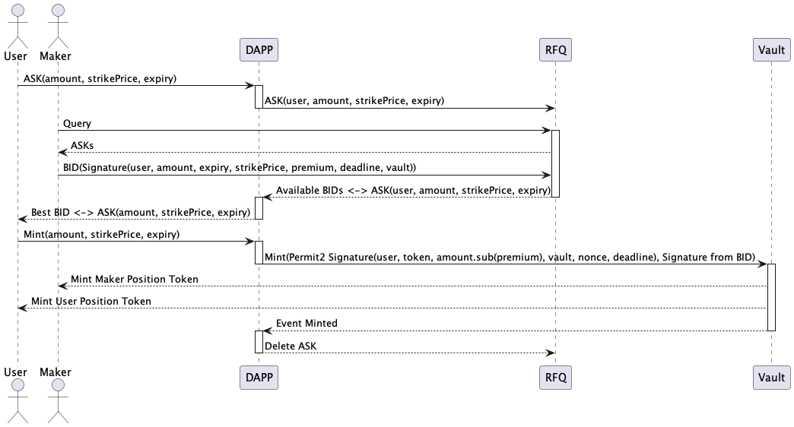
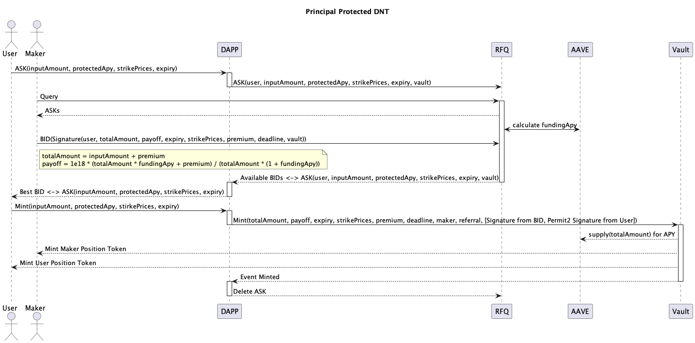
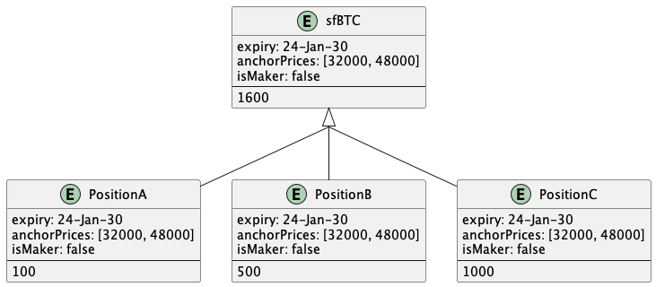

# Technical Design

## Blockchain Support

The DCV-Exotic protocol will be launched on **Ethereum and other L1 EVM blockchains** to start.

Position Tokens with the same Strike Price and Expiry Time are fungible like any standard token, and can be batch settled in a single operation to allow significant gas savings.

