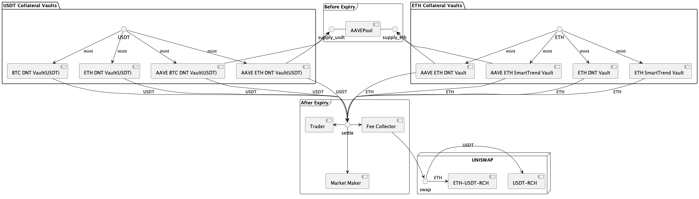
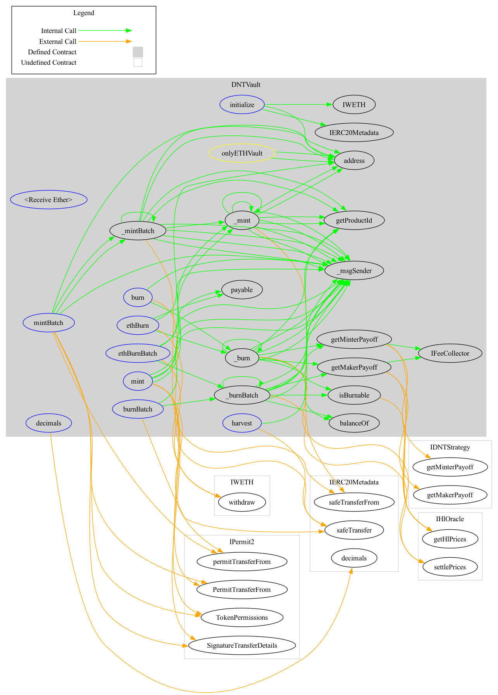
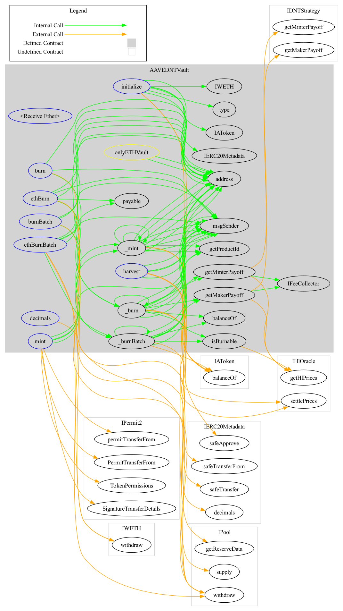
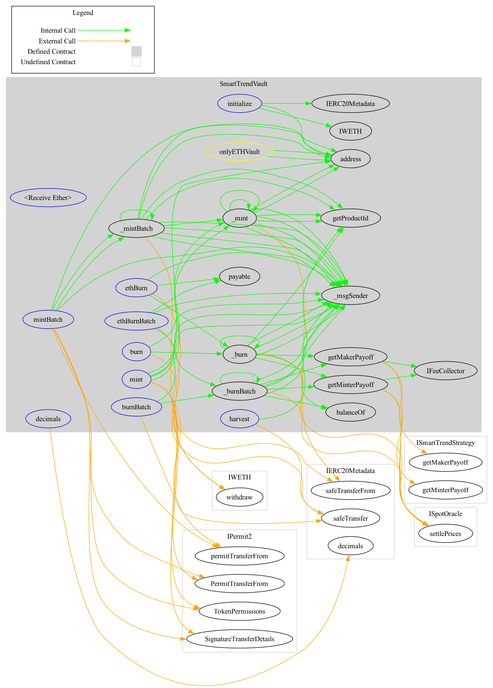
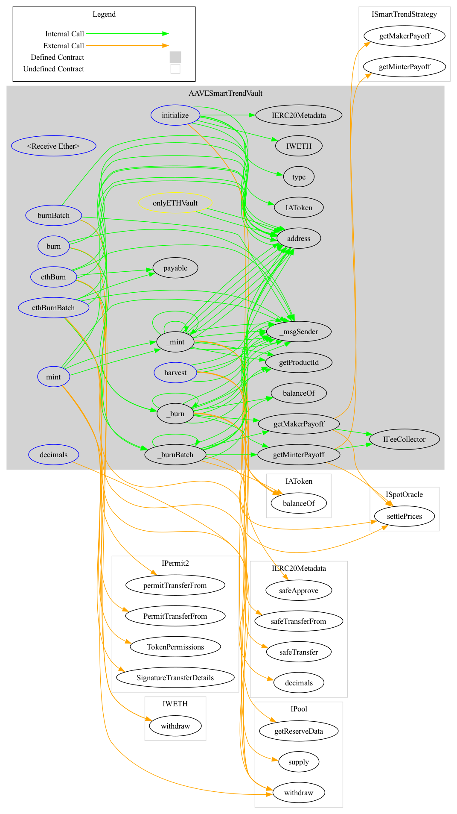
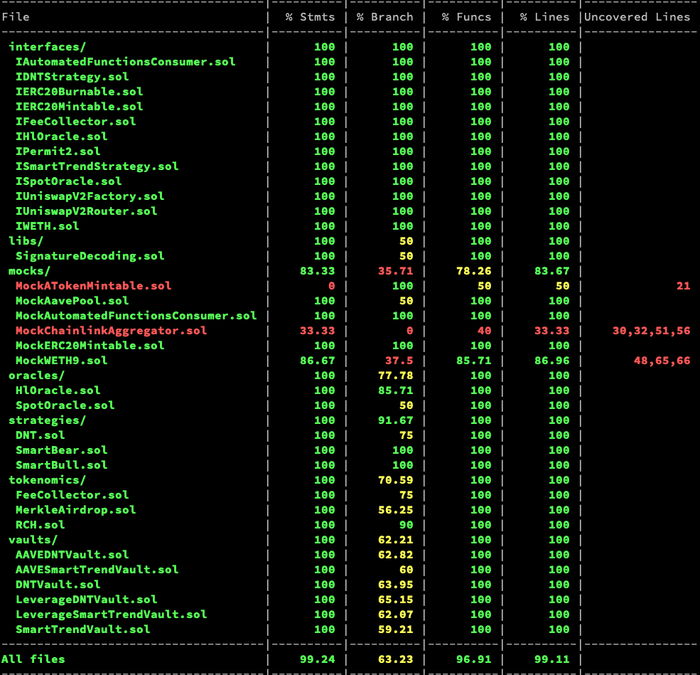

# Protocol Security Considerations

Security has been our primary and utmost focus since inception.  The spirit of blockchain is trustless decentralisation, with the trustless component contingent on air-tight security and asset safety.  Ultimately, the core of the entire DeFi ecosystem hinges on asset safety, so ensuring zero-risk to user funds is the primary driver behind every part of our design.

In the spirit of full transparency, we have written a FAQ to cover some of the common questions on and decisions behind our protocol architectural, code implementation, testing, contract audits, time locks, and bug bounty programs, particularly in terms of how they contribute to maximizing the security and safety of the SOFA.org protocols.

## Frequently Asked Questions (FAQ):

### _Protocol Architecture_

1. **How do you handle collateral management and liquidation risks as a settlement and clearing platform?**

   - The SOFA.org protocols work off an innovative, fully funded model which requires both entities to pre-fund their maximum exposures into the vault upon execution.  The net exposures are zero-sum by nature, so the capital at risk never exceeds what's originally deposited at trade inception.  No margin calculations are required in the interim, with no risks of flash loan attacks either.  Liquidty is unlocked via the use of replicating Position Tokens (ERC-1155), allowing the transfer of the _ownership claim_ without infringing on the underlying collateral.

2. **How are the different vaults and contracts interconnected?  Are locked assets properly segregated?  How are assets transferred upon final settlement?**

   - Individual vaults are built to serve each individual structured product type and its associated collateral.  Vaults exist individually without cross-dependencies on each other.  Locked assets are contained within the specific vault contract linked to its traded product type, and can only be redeemed by the holders of Position Tokens, or converted into fees and repurchased into the $RCH pool by the FeeCollector contract.  There are no other ways to transfer assets within the contract otherwise.

    

3. **How does SOFA.org ensure the accuracy and integrity of its pricing data to mitigate pricing discrepancy or manipulation concerns on settlement fixing calculations?**

   - We will utilize ChainLink's services to provide decentralized pricing references, via their time-tested DataFeeds (for spot) and Functions (for historical) methods.  The Functions method will publish Coinbase API data directly on the contract on-chain, with the underlying code being fully transparent and verifiable by anyone in the public domain.
   - Additionally, the protocol will also use TheGraph to synchronize historical data from the dAPP, with the query service also being a transparent and inspectable code that is visible to everyone.

4. **Can you please explain what you mean by a "fair launch" of the protocol's native $RCH tokens?**

   - The protocol's tokenomics model will be a 'fair launch' format where no participant, not even the core development team, will be allocated any tokens ahead of time.  Out of the fixed 37M float, the initial 25M of $RCH tokens will minted into a Uniswap pool along with burned LP tokens (ie. captive liquidity), while the final remaining 12M of $RCH tokens can _only_ be obtained through transaction (usage) airdrops.  The lack of up-front allocation, and the steady usage-based accumulation should ensure a more balanced token supply/demand picture upon TGE.  This should help minimize the risks of 'liquidity dumps' and other typical 'post-cliff' exit liquidity issues that have plagued many other token projects.

### _Smart Contract Code_

- All of our smart contract code will be publicly released on Github under sofa-org, allowing full public access and validation.
- We have adopted the MIT permissive software license, encouraging and inviting more collaborative development efforts on expanding the protocol's ecosystem.
- Added reentrancy checks to all methods involving fund transfers to minimize vulnerability.
- Reduced all bloated and unnecessary permission management processes over the multi-sig process, minimizing human errors over permission mis-use or private key leakage.
- Full Solidity (0.8.10) adoption to ensure compatibility in compiling all contracts while preventing vulnerabilities due to different compiler versions.
- Used OpenZeppelin's standard contracts to avoid introducing vulnerabilities through development redundancies.

### DNTVault Design

### AAVEDNTVault Design

### SmartTrendVault Design

### AAVESmartTrendVault Design

## Testing

- Tested coverage for non-mock contracts, demonstrating that statements, functions, and lines coverage all reached 100%.
- Used a variety of automated contract audit tools, such as Slither.

## Audit

SOFA.org has invited the most reputable and professional security firms in the industry to audit our contracts.  We view auditing as an ongoing process and will continue to invite more auditors into the mix as the protocol evolves.

- [PeckShield](https://github.com/peckshield/publications/tree/master/audit_reports/PeckShield-Audit-Report-Sofa-v1.0.pdf) 

## Timelock

- All owner permissions for deployed contracts will be on Timelock contracts.  As such, any changes submitted by developers will only take effect after 24 hours, giving ample reaction time for users to withdraw their funds should there be issues introduced with a code update.
- Changes to submitted Timelock contracts will require approval from multi-signature wallets, ensuring that all code changes will be reviewed and scrutinized by multiple participants before being pushed.

## Bug Bounty

- We will bug bounty programs on security platforms. These programs offer generous rewards to those who find and identify vulnerabilities, helping reinforce the security foundation of the SOFA.org ecosystem.

In summary, SOFA.org wants to foster a fair, decentralized, open-source and transparent working community striking for the common goal of building a better DeFi system.  We hope and encourage every member of the community to join and contribute on this journey together.  As always, we are looking for better ways to enhance the security foundation of our protocol, and we are open to and welcome your valuable suggestions on this front.

