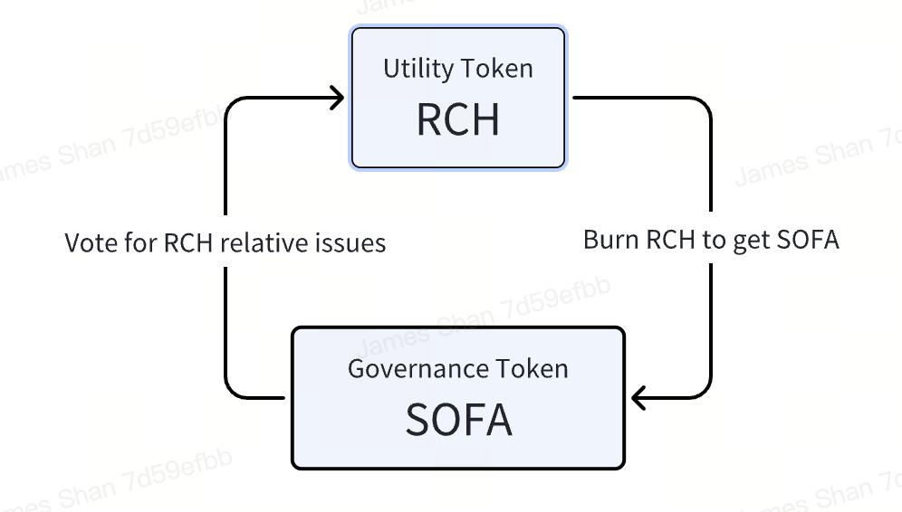

# Dual-token model

SOFA.org has meticulously designed a dual-token model to operate ecosystem tokenomics.  The protocol's native utility token is called $RCH, while the governance token is appropriately named $SOFA.

