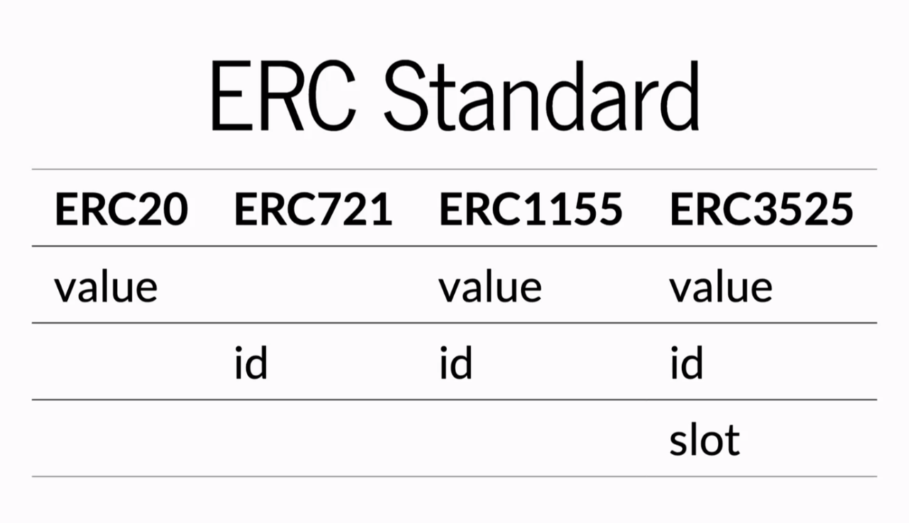

## نطاق المنتج

ستركز بروتوكول SOFA **في البداية على تسوية وتوكنينغ المنتجات الهيكلية المشفرة** كدليل على المفهوم. نحن نتبع "الطريق الأقل سلوكًا" لمهاجمة أكثر المنتجات تعقيدًا أولاً، حيث ستشهد عملية النشر الناجحة توسعًا سريعًا إلى جميع فئات الأصول المشفرة الأخرى. سيتم إطلاق بروتوكول SOFA على **Ethereum وغيرها من سلاسل الكتل L1 EVM** للبدء.

## سير عمل البروتوكول

نظرة عامة عالية المستوى على تنفيذ صفقة نموذجية عبر SOFA هي كما يلي:

- يقوم صناع السوق المؤسسيون المشاركون ببث أسعار قابلة للتنفيذ على المنتجات الهيكلية باستمرار إلى تطبيق البروتوكول اللامركزي
- يختار المستخدم وينفذ شراء منتج هيكلي معين بناءً على السعر المعروض
- تُرسل الأصول الملتزمة من المستخدم وتُقفل في خزينة DeFi الخاصة بالمنتج
- تُرسل أيضًا أقصى تعرض للعمولة لصانع السوق وتُقفل في الخزينة
  - _ملاحظة: لن يتم تنفيذ المعاملة إذا فشل أي من الجانبين في تقديم أصوله المطلوبة في هذه المرحلة_
- سيتم سك رموز المراكز المقابلة (التي تشير إلى تفاصيل الأصول) لكل من المستخدم وصانع السوق، قابلة للتحويل بحرية مثل أي رمز ERC-20 تقليدي إلى أي وجهة محفظة أخرى

- **للهياكل "الربحية" فقط،** سيتم رهن الضمان في الخزينة في بروتوكولات كسب العائد الناضجة والآمنة مثل Compound وAAVE وما إلى ذلك لكسب مستوى أساسي من الفائدة للمستخدمين
  - سيتم وضع تدقيق إضافي على هذه الخطوة، مع التصويت على الوجهات المؤهلة من قبل حاملي رموز الحوكمة

- أخيرًا، عند انتهاء المنتج، سيتم الإفراج عن المدفوعات ذات الصلة ويمكن المطالبة بها في الخزينة من قبل كل من المستخدم وصانع السوق
  - إذا تم نقل رموز المراكز المعنية إلى محفظة جديدة، سيتمكن مالك العنوان من المطالبة بالأصل في أي وقت بعد انتهاء الصلاحية

## معايير الرموز (ERC-1155)

**يقوم بروتوكول SOFA بتوكنينغ المراكز المقفلة على السلسلة للمستخدمين عبر معيار الرموز المتعددة ERC-1155، مسجلاً تفاصيل المراكز الحيوية مثل [تاريخ الانتهاء]، [أسعار الربط]، [تبديل الصانع/المتداول]، وحقول أخرى ذات صلة بالأداة المعنية**.

بالمقارنة مع معايير الرموز ذات الأصل الواحد التقليدية، يسمح ERC-1155 بإنشاء وإدارة أنواع متعددة من الرموز ضمن عقد واحد، مع دعم كل نوع من الرموز بخصائص مختلفة. يمكن دمج أو تقسيم المراكز ذات المعلمات نفسها، مع تمكين التحويلات بسهولة مثل رموز ERC-20 القياسية. **توازن هذه الابتكار بين توافق الأصول الواسع، والمرونة العالية، وكفاءة الغاز**.

تكون رموز المراكز التي لها نفس سعر التنفيذ ووقت الانتهاء قابلة للتبادل مثل أي رمز قياسي، ويمكن تسويتها دفعة واحدة في عملية واحدة للسماح بتوفير كبير في الغاز.