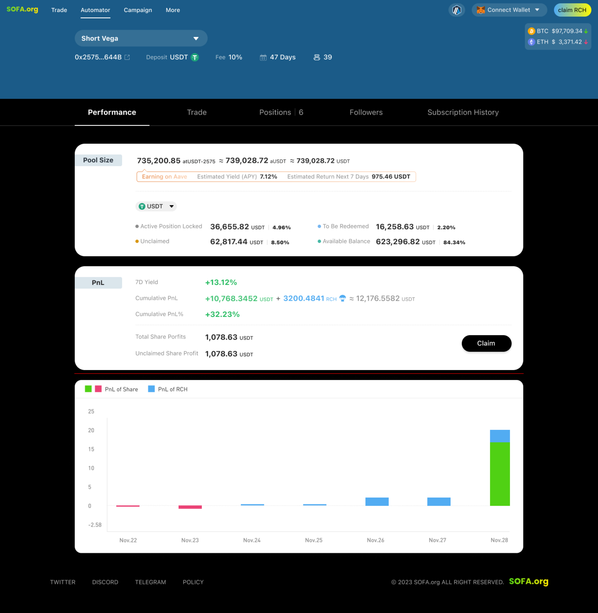

# Automator

## Einführung

In unserer Mission, den Optionshandel für die Massen zu demokratisieren, hat das SOFA-Team **Automator** als intuitive Möglichkeit geschaffen, damit Benutzer passiv Strategieerträge erzielen können. Durch die Nutzung einer Gemeinschaft von Strategiemanagern, die gemeinsam als **Optivisors** bekannt sind, können Benutzer an ihren bevorzugten verwalteten Strategien teilnehmen, im Austausch für eine kleine Gewinnbeteiligungsgebühr. Dieses Win-Win-Modell wird dezentralen und On-Chain-Zugang für Einleger bieten, um eine Vielzahl von hochwertigen Renditen mit einer sich entwickelnden Basis von gemeinschaftlich anerkannten Optivisors zu erzielen.

## Wichtige Automator-Funktionen

1. **Gemeinschaftsorientiertes Design.**  Der Start von Automator spiegelt unser Engagement für die Einbindung der Gemeinschaft wider und bietet dezentrale Werkzeuge, um die DeFi-Optionshandelsreise zu demokratisieren, während der Benutzerzugang zu sicheren Ertragslösungen erweitert wird, die sich im Laufe der Zeit weiterentwickeln.

2. **Intuitive Benutzeroberfläche.**  Komplexe Optionsstrategien wurden in eine intuitive und einfach zu bedienende Benutzeroberfläche destilliert, während vollständige On-Chain-Transparenz und Strategiedisclosure im Einklang mit dem DeFi-Ethos angeboten werden.

3. **Marktunabhängig.**  Profitieren Sie von Volatilitätsbewegungen in beide Richtungen, wobei SOFA-Produkte den Optivisors vollständige Strategieflexibilität unabhängig von der Marktentwicklung bieten.

4. **Erhebliche Gasersparnisse.**  Optivisors können ihre laufenden Strategien auf Automator ohne zusätzliche Gaskosten "rollen", was langfristige Rentabilität und Nachhaltigkeit fördert.

## Optivisors: Unsere Gemeinschaftsstrategiemanager

Eine der herausragenden Eigenschaften von Automator liegt in seinem gemeinschaftsorientierten Ansatz. Durch die Einbindung der kollektiven Weisheit unserer DeFi-Community sind Strategiekreatoren, auch bekannt als Optivisors, in der Lage, laufende SOFA-Strategien zum Nutzen passiver Einleger zu entwerfen, auszuführen und zu überwachen. Im Austausch für ihr Fachwissen erhalten Optivisors einen Anteil am _gesamt_ strategischen Gewinn, um ein Win-Win-Ergebnis zu schaffen, das wirtschaftliche Anreize ausrichtet und langfristiges Engagement fördert.

Während SOFA weiterhin sein Produktangebot und die Kettenkonnektivität erweitert, werden Optivisors eine zunehmend wichtige Rolle in unserem Ökosystem spielen, da ihre Strategien in Komplexität und Reichweite skalieren. Die Protokollerweiterung auf zusätzliche Instrumente und CeFi-Konnektivität bietet realisierbare Meilensteine, auf die wir uns freuen können, und wir ermutigen fortlaufendes Feedback aus der Gemeinschaft, um uns zu den nächsten Schritten zu führen.

## Automator Arbeitsablauf

## Automator FAQ

### A. Wie funktioniert Automator?

Automator umfasst drei Hauptteilnehmer: **Benutzer**, **Optivisoren** und **Marktmacher**.

1. **Benutzer**

   Benutzer können ihren bevorzugten Automator auswählen und Token einzahlen. Unter der Expertise des Optivisors generiert der Automator Renditen, die unter den teilnehmenden Benutzern verteilt werden. Darüber hinaus profitieren die Benutzer von Anreiz-Airdrops des $RCH-Tokens im Rahmen ihrer Teilnahme.

2. **Optivisoren**

   Optivisoren sind verantwortlich für die Erstellung von Automatoren und die Ausführung von Handelsstrategien – wie bullischen und bärischen Positionen – durch Interaktion mit SOFA Vaults. Als Belohnung für ihre Expertise verdienen Optivisoren einen Anteil an den Gewinnen.

3. **Marktmacher**

   Ähnlich wie bei anderen SOFA-Produkten bieten Marktmacher Preise für SOFA Vaults an. Optivisor-Manager nutzen diese Angebote, um Automator-Fonds zuzuweisen und an SOFA Vault-Strategien teilzunehmen. Sobald diese Strategien abgeschlossen sind, werden die Gewinne entsprechend verteilt.

### B. Welche Gebühren werden mir berechnet?

Das Protokoll erhebt eine Servicegebühr von 15 % auf die von Automatoren generierten Gewinne. Wenn keine Gewinne erzielt werden, fallen keine Servicegebühren an.

Optivisoren können auch eine Verwaltungsgebühr festlegen, wenn sie einen Automator erstellen. Diese Gebühr gilt nur für Gewinne, wird jedoch während Verlustperioden als Verbindlichkeit erfasst. **Der Optivisor kann Verwaltungsgebühren erst wieder einziehen, wenn die kumulierten Gewinne des Automators positiv werden.**

### C. Wie werde ich Optivisor und erstelle einen Automator?

Jeder kann als Optivisor einen Automator erstellen. Allerdings ist jede Adresse auf die Erstellung eines Automators pro Kette und Token-Typ beschränkt. Um das Strategie-Kontingent freizuschalten, muss der Optivisor 500 $RCH-Token verbrennen.

### D. Wie sieht es mit den Gasgebühren innerhalb des Automators aus?

Der Optivisor ist verantwortlich für die Deckung aller Gasgebühren, die mit Transaktionen innerhalb des Automators verbunden sind.

### E. Wie kann ich meine Mittel nach der Einzahlung in einen Automator abheben?

Automatoren funktionieren wie Fonds und verfügen über eine Rücknahme-Sperrfrist, um die Liquidität und die Ausführung der Strategie zu verwalten. Abhebungen können jederzeit initiiert werden, erfordern jedoch das Warten bis zum Ende der Sperrfrist, die bis zu 30 Tage betragen kann, wie vom Optivisor bei der Erstellung festgelegt.

### F. Welche Arten von Renditen kann ich von einem Automator erwarten?

Die Renditen des Automators setzen sich aus drei Hauptkomponenten zusammen:

1. **Zinsen**

   - In den Automator eingezahlte Mittel werden automatisch in risikoarmen Protokollen wie Aave oder Curve gestakt, wodurch passive Zinsen generiert werden.
   - Diese Renditen werden in Echtzeit aktualisiert und den Benutzern basierend auf ihrem Anteil beim Abheben verteilt.

2. **Trading PNL**

   - Erträge, die aus den Handelsstrategien des Optivisors generiert werden
   - Diese Erträge werden erst nach Ablauf der Handelsstrategie reflektiert, wodurch der Optivisor die Positionen beanspruchen kann. Die Benutzer erhalten ihren Anteil bei der Abhebung.

3. **$RCH-Anreiz**

   - $RCH-Token-Airdrops, die durch die Handelsaktivitäten des Optivisors verdient werden.
   - Airdrops werden täglich basierend auf den aktuellen Inhabern des Automators und deren jeweiligen Eigentumsanteilen verteilt. Benutzer können ihre $RCH-Token direkt von der **Claim $RCH**-Seite beanspruchen.

### G. Welche Risiken sind mit der Nutzung eines Automators verbunden?

Automatoren sind mit Risiken verbunden, da der Optivisor Benutzerfonds für den Optionshandel und risikoarme Protokolle verwaltet. Der Optivisor entscheidet über das Gleichgewicht zwischen der Verwendung von Zinserträgen oder dem Kapital für den Handel, was das Risikoniveau des Automators beeinflusst. Jeder Automator hat eine Puffergrenze, die bis zu 99,9% betragen kann, was den Teil der Mittel angibt, der für risikoärmere Protokolle reserviert ist. Benutzer können den spezifischen Puffer für jeden Automator einsehen, um einen auszuwählen, der mit ihrer Risikotoleranz übereinstimmt. SOFA garantiert keinen risikofreien Handel, und ein Kapitalverlust ist möglich. Bewerten Sie Ihre Risikotoleranz sorgfältig, bevor Sie teilnehmen.

### H. Wie wird der $RCH-Airdrop generiert und auf das Benutzerkonto verteilt?

$RCH-Token werden durch die Handelsaktivitäten des Optivisors verdient und können von den Benutzern anschließend beansprucht werden, genau wie in anderen SOFA Vaults. Sie können die Informationen zum $RCH-Airdrop hier überprüfen: [https://docs.sofa.org/en/tokenomics/](https://docs.sofa.org/en/tokenomics/)