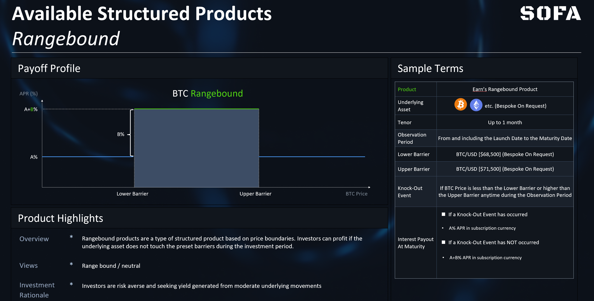

# Vault-Klassifizierung

Der Vault-Vertrag verwendet den ERC-1155-Standard, um **die Fungibilität von Positionstoken mit demselben Ausübungspreis und Ablaufdatum zu unterstützen**. Token mit unterschiedlichen Ausübungspreisen oder Ablaufzeiten haben unterschiedliche Token-IDs (d.h. wie ein NFT), sind jedoch weiterhin unter demselben Vault-Vertrag enthalten.

Das SOFA-Protokoll ist so konzipiert, dass es die Flexibilität **unterstützt, um jeden strukturierten Produkttyp und jede Besicherungswährung zu unterstützen**, wobei jedoch ein Unterschied gemacht wird, ob das zugrunde liegende Produkt eine Funktion zur 'Kapitalschutz' enthält oder nicht. Daher sind unsere **Vault-Designs in 2 Hauptkategorien unterteilt, die sich selbst erklären und 'Earn' und 'Surge' genannt werden**.

Beispiel für die Vault-Taxonomie zum SOFA-Start

## Verfügbare Produkte zum Start

Als unser erstes Proof-of-Concept werden wir uns zunächst auf drei beliebte Produktstrukturen konzentrieren, die **'Rangebound' und 'Trend'** genannt werden. Darüber hinaus sind all diese Produkte entweder im Earn- oder im Surge-Protokoll verfügbar. Zudem werden kontinuierlich weitere Produkttypen basierend auf der Nachfrage der Nutzer und dem Feedback des Ökosystems hinzugefügt.

## Rangebond-Produkte

### Produktübersicht

Rangebound-Produkte sind eine Art von strukturiertem Produkt, das auf Preisgrenzen basiert. **Einleger können profitieren, wenn der zugrunde liegende Vermögenswert während des Beobachtungszeitraums vor der Fälligkeit die festgelegten Barrieren nicht berührt**. Diese Produkte sind geeignet für Nutzer, die erwarten, dass der Markt in einer seitwärts gerichteten Konsolidierungsphase mit gedämpfter Volatilität bleibt.

Bezogen auf das untenstehende Auszahlungsschema glaubt ein Nutzer, dass BTC zwischen einem Bereich gefangen sein wird, der durch die unteren und oberen Barrieren definiert ist, möchte jedoch nicht viel Risiko eingehen, selbst wenn sich die Sichtweise als falsch herausstellt. Das Rangebound-Produkt garantiert dem Nutzer eine Mindestbasisrendite von (A), selbst wenn der Preis von Range von einer Seite ausbricht, aber der Nutzer hat Anspruch auf eine zusätzliche Gewinnrendite, die (A+B) entspricht, sofern die Preise innerhalb der Barrieren bleiben.

Für Anpassungsoptionen **hat der Nutzer die Freiheit, die Breite des Preisbereichs anzupassen, was ein unterschiedliches Profil von Basis- und Aufwärtsgewinnen je nach gewählten Niveaus zur Folge hat**. Natürlich stellt die Angabe eines engeren Preisbereichs eine aggressivere Wette auf niedrige Volatilität dar, was zu höheren Aufwärtsrenditen führen würde. Umgekehrt würde ein breiterer Preisbereich die übermäßigen Gewinne senken und im Gegenzug eine höhere Gewinnwahrscheinlichkeit bieten. Schließlich kann das Produkt zur einfacheren Verwaltung so festgelegt werden, dass es bei Fälligkeit automatisch 'neu gerollt' wird als Fortsetzungswette bei einem späteren Protokoll-Upgrade. (Die 'Re-Roll'-Funktion wird in der nächsten Phase des Upgrades eingeführt).

## Trend-Produkte

### Produktübersicht

Das **Trend-Produkt ist geeignet für Einleger, die erwarten, dass der Markt bald einen sanften und stetigen Trend durchlaufen wird, aber dennoch einen gewissen Kapitalschutz wünscht**. Durch die Definition sowohl einer unteren als auch einer oberen Preisbarriere beginnen die Nutzer, Einkommensgewinne zu erzielen, sobald das zugrunde liegende Instrument die anfängliche Preisgrenze überschreitet, mit steigenden Auszahlungen, bis wir ein Maximum an der 2. Grenze erreichen.

Darüber hinaus beobachtet das Trend-Produkt im Gegensatz zum Rangebound-Produkt nur zum Zeitpunkt der Abrechnung, ob der Preis des zugrunde liegenden Vermögenswerts innerhalb des festgelegten Bereichs liegt, um den endgültigen Gewinn zu bestimmen (d.h. europäische Option). **Dieses Produkt ist sowohl über bullische als auch über bärische Ausdrücke verfügbar**.

Als Beispiel, wenn ein Nutzer bullisch auf BTC ist und vorhersagt, dass der Preis von BTC in den nächsten sieben Tagen über 68.500 $ bleiben, aber 71.500 $ nicht überschreiten wird, kann er wählen, ein Bull Trend-Produkt zu kaufen, wobei 68.500 $ als untere Grenze und 71.500 $ als obere Grenze des Gewinnbereichs festgelegt werden. Bezieht man sich auf das Diagramm unten, wird der Nutzer zum Zeitpunkt der Abrechnung für eine Auszahlung zwischen einem Basisgewinn von (A) und einer oberen Grenze von (A+B) berechtigt, abhängig davon, wie der Preis von BTC zu diesem Zeitpunkt ist.

### Anwendbare Szenarien

Das Produkt könnte **geeignet sein für Einleger, die glauben, dass ein Vermögenswert stark auf ein bestimmtes wirtschaftliches Ereignis reagieren wird, sich jedoch auch über das Risiko eines Preisrückgangs Sorgen machen, falls sie mit ihrer Markteinschätzung falsch liegen**.

Zum Beispiel könnte der Nutzer darauf spekulieren, dass die BTC-Preise bei der nächsten FOMC-Entscheidung, dem Halving-Ereignis oder der nächsten Ankündigung zur Genehmigung eines ETFs steigen werden. Diese Strategie ist **geeignet für Nutzer, die eine starke Marküberzeugung in Bezug auf diese wichtigen, aber riskanten Ereignisse haben und diszipliniert mit möglichen Verlusten umgehen möchten**, falls sich ihre Sichtweise als falsch herausstellt.

## Shark Fin (Für später)

### Produktübersicht

Im Vergleich zu Rangebound- und Trendprodukten ist das 'Shark Fin'-Produkt in den TradFi-Märkten aufgrund seines einprägsamen Namens relativ bekannter. Sein Design und die Auszahlung sind ähnlich wie bei Trend (d.h. europäische Option), mit der **Hauptexzeption, dass der Einleger viel aggressiver auf Preise spekuliert, die sich innerhalb eines bestimmten Bereichs befinden**.

Anders ausgedrückt, das Shark Fin-Produkt **vertritt eine konservativere Sicht auf die Marktvolatilität, indem es mehr Aufwärtspotenzial bei einer großen Marktbewegung opfert, im Austausch für aggressivere Gewinne innerhalb der unteren Preisgrenzen**.

Als Beispiel nehmen wir an, ein Nutzer ist optimistisch bezüglich BTC, hat jedoch eine hohe Überzeugung, dass es eine bestimmte obere Grenze an einem starken technischen Widerstandsniveau nicht überschreiten wird. In einem solchen Szenario kann der Nutzer wählen, ein Bullish Shark Fin-Produkt mit einem Auszahlungsprofil gemäß dem Diagramm unten zu kaufen. Bei der Produktabrechnung erhält der Nutzer eine Rendite, die von (A) bis (A+B) reicht, abhängig davon, wo der Spot-BTC liegt; jedoch, im Gegensatz zu Trendprodukten, beachten Sie, dass die Rendite _fällt_ auf (A+C), wenn die obere Preisgrenze überschritten wird, was einen Kompromiss im Austausch für aggressivere Gewinne im vorhergehenden Bereich bietet.

