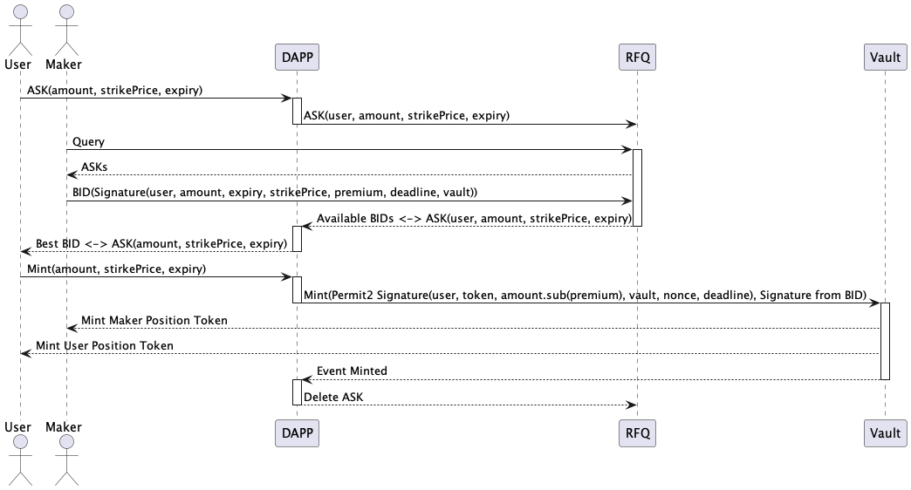
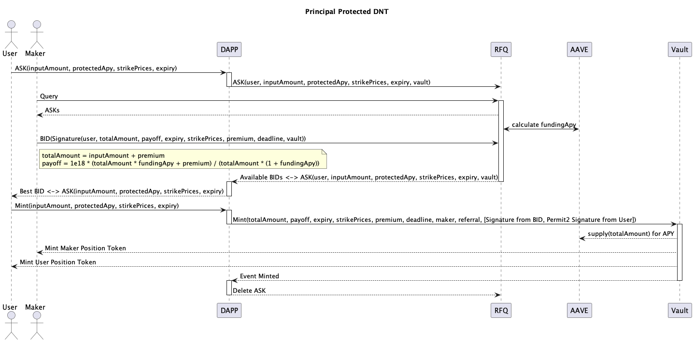

# Introduction

## What Are We Trying To Accomplish

### CeFi lack of transparency

The crashes of CeFi giants like 3AC, FTX, and Genesis have yet again brought to light the issues with centralization. Investors are now seeking greater transparency, protection of assets, and predictable outcomes without any unexpected shocks.

### Lack of user friendly, CeFi comparable structured products on DeFi

The progress and adoption of professional structured products on DeFi are still in the early phases. Despite the abundance of protocols in the DeFi space, the majority of them offer yield products that are quite similar and fall within limited categories such as AMM LP, lending, LSD, and cash-settled options selling. At present, there are very few DeFi protocols that can offer structured products that can match the ease of use and complexity of products provided by CeFi, let alone the more intricate products that are prevalent in traditional finance.

### Build transparency, friendly, composability, flexibility, variety structured products on DeFi

In DeFi, building transparency, friendliness, composability, flexibility, and variety in structured products is crucial. These products not only offer users more financial tools and opportunities but also drive innovation and development across the entire industry.

Transparency is the foundation of constructing DeFi structured products. Through blockchain technology, all transactions and operations can be recorded and traced, allowing users to view and verify the workings and performance of the products at any time. Transparency increases user trust and contributes to a fair and equitable market environment.

Friendliness is a significant factor in focusing on user experience. User interfaces should be intuitive, easy to navigate, and operate. Moreover, products should consider user needs and interests, providing clear explanations and help documentation to ensure users fully understand the product's features and risks.

Composability refers to the seamless integration and interaction of DeFi structured products with other products and services. This enables users to combine different products based on their needs and investment strategies, achieving more complexity and customization.

Flexibility is essential in structured products on DeFi. Users should have the flexibility to customize and tailor the products to their specific requirements, whether it's adjusting parameters, selecting risk profiles, or choosing different investment strategies. Providing this flexibility empowers users and enhances their ability to optimize their financial activities.

Lastly, variety plays a significant role in offering a range of structured products on DeFi. Diverse options allow users to choose from various risk levels, asset classes, investment horizons, and reward structures. This variety not only caters to different user preferences but also contributes to the overall growth and maturity of the DeFi ecosystem.

By focusing on transparency, friendliness, composability, flexibility, and variety, we can create a vibrant and inclusive DeFi landscape that empowers users and fosters innovation.

## Protocol Implementation

Sofa.org collaborates with institutional Market Makers who provide streaming market prices to the platform. When a client logs in to trade, the client's subscription assets are automatically sent to the DeFi vault as soon as they choose to trade on the quote. The market maker's premium is also automatically transferred to the vault. Once both client subscription assets and market maker premium are in the vault, it is locked, and no one can touch the assets. Both of them will get the proper amount tokens minted which stand for their positions. The position tokens can be transferred or traded like normal ERC20.

The collateral in the vault would be staked into mature and safe yield earn protocols like Compound, AAVE and etc. to earn interests for clients.

The vault contract use ERC1155 standard. Position tokens with the same strike price and expire time can be transferred like ERC20. Tokens with different strike prices or the expiration time have different token id(NFT) but in the same vault contract.

All position tokens with the same expiration time can be settled once, which can save gas significantly.

## Features

### Position Tokenlization

Both clients and market makers can transfer their position tokens. They can trade, stake or do anything as they did to their ERC20 tokens.

### Flexibility

Support structured products with different expiration dates, strike prices, tokens, and strategies, providing a one-stop solution to meet all user needs.

### Composability

Side protocols can be built from the SOFA protocol, including lending, swap, staking, yields and etc.

### Transparency

All assets are on chain, and all transaction records are traceable on the chain, ensuring the transparency of the protocol.

### Friendly

By utilizing professional product design and process optimization, the learning curve is greatly reduced, making it simple, easy to understand, and user-friendly.

### Variety

A variety of products can be supported by the structure of offchain RFQ + onchain vault.

### ERC1155

ERC1155 is a token standard on the Ethereum that enables the creation of fungible and non-fungible tokens within the same smart contract. This means that developers can create a single smart contract that can manage multiple tokens, including both non-fungible tokens and fungible tokens that can be traded interchangeably. It provides a more efficient and flexible solution for managing a large number of assets while reducing gas costs and minimizing the need for multiple smart contracts.

### Gas efficiency

我们使用 [Permit2](https://github.com/Uniswap/permit2) 降低用户的 approve 成本，不同于常见的对每个 vault 合约都要进行一次或多次授权后才能进行交易的解决方案，用户如果已经在使用其他协议时对 Uniswap 的 permit2 合约进行过授权，使用 Sofa.org 的 vaults 则无须再进行授权，如果没有，则只需要对 permit2 授权一次无须针对每个 vault 进行授权。

|          | **sofa.org**                       |                                           | **Others** |              |            |
| -------- | ---------------------------------- | ----------------------------------------- | ---------- | ------------ | ---------- |
|          | ApexWinnings Tickets Vault Deposit | Capital Protected Earnings  Vault Deposit | Transfer   | Uniswap Swap | Curve Swap |
| Gas Used | 154K~208K                          | 192K~298K                                 | 21K        | 105K~170K    | 114K~764K  |

统计数据表明，使用 Sofa.org Vaults 铸造头寸的 Gas 消耗仅为 Uniswap 交易操作的 1-2 倍。与市场上的类似产品相比，Sofa.org 在 Gas 消耗上更为低廉和高效。
