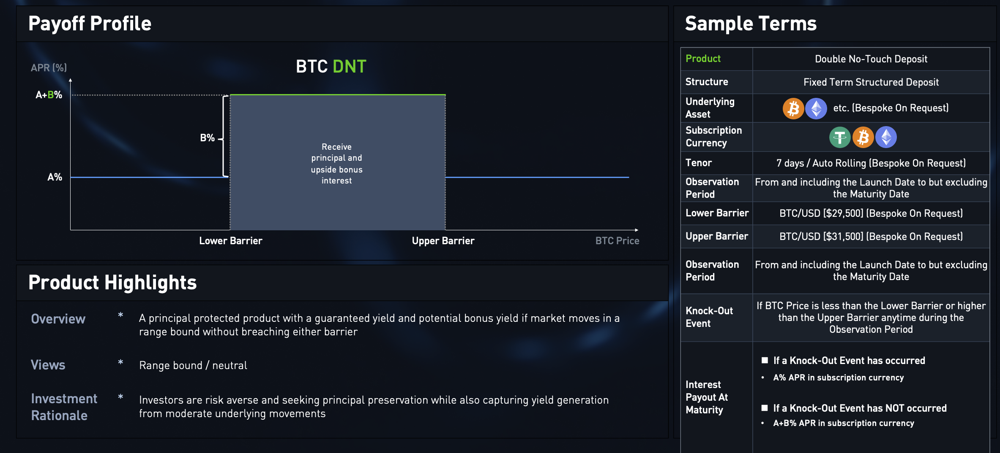
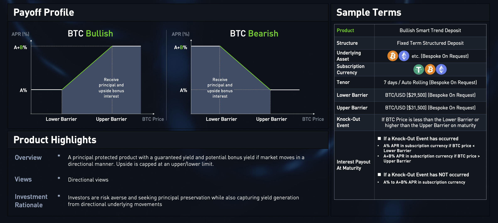

# Vaults

Thanks to the meticulous design of the Sofa.org protocol, in theory, we can support structured products of any type and any collateral.

The products currently launched can be categorized into two types: Double No Touch and Smart Trend, with plans to introduce more types in the future.

From an investment preference perspective, they can be divided into high-return and principal-protected types. The principal-protected products invest users' principal in protocols like AAVE to earn interest, and a portion of the interest is used to place bets with market makers.

Based on the above classification standards, different underlying assets and collaterals are combined to create various Vault contracts.

## Classification by Product Type

### Double No Touch (DNT)

Double No Touch products are a type of structured product based on price boundaries. Investors can profit if the investment does not reach the preset high or low price points during the investment period. These products are suitable for investors who expect the market to stay within a specific price range with lower volatility.

### Smart Trend

Smart Trend products are suitable for markets expected to move in one direction. They also feature two preset price points, high and low. By subscribing to the product, you can predict the market direction and enjoy enhanced returns if the price moves in the direction you predicted.

## Classification by Risk Preference

### Principal-Protected

Principal-protected products are designed for risk-averse investors. Users' principal is invested in well-known protocols such as AAVE, with stable interest income as the basis for safe asset appreciation. A portion of the interest is used for betting with market makers, aiming to secure the principal while tapping into additional earning potential.

### High-Return

For investors with a higher risk tolerance pursuing maximized returns, we offer high-return products. These products may bring higher returns but also come with corresponding risks.

