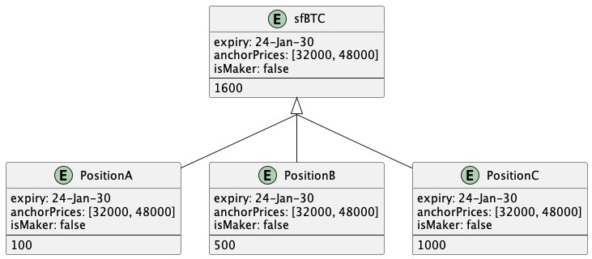
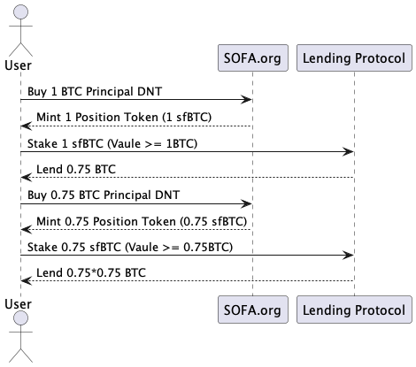

# Tokenized Positions

At Sofa.org, we tokenize users' positions using the ERC-1155 multi-token standard. Compared to traditional single-asset token standards, ERC-1155 allows the creation and management of multiple types of tokens within a single contract, with support for each type of token having different properties. This innovation not only makes it possible to manage and transfer a variety of assets but also offers users additional flexibility and efficiency.

Through the ERC-1155 standard, positions with the same parameters can be merged or split, enabling transfers as conveniently as ERC-20 tokens. This significantly enhances the liquidity of positions, opening doors for users to engage in on-chain trading and many more financial operations.

## Feasible Cases: Secondary Market Trading

Tokenized positions held by users can be traded on decentralized exchanges just like ordinary ERC-20 tokens. This provides seamless market access for buying and selling positions, greatly enhancing trading efficiency and convenience.

## Feasible Cases: Collateralized Lending

Besides on-chain trading, tokenized positions can also be used for collateralized lending. Users can use their positions as collateral to obtain loans in other cryptocurrencies or stablecoins, offering more options for liquidity.

## Feasible Cases: Collateral on Centralized Exchanges

As the bridge between DeFi and centralized finance (CeFi) continues to improve, tokenized positions even have the opportunity to be deposited into centralized exchanges as collateral to support more derivative trading, further enhancing the liquidity and applicability of assets.

## More Cases

The above are just the three most common derivative scenarios realized through tokenized positions. In fact, in our vaults, countless products with different parameters can coexist, providing users with a wealth of investment choices. Products with the same parameters are aggregated together, offering the same flexibility and convenience as ERC-20 tokens, allowing users to transfer and manage them without friction.

By tokenizing positions with the ERC-1155 standard, Sofa.org not only ensures the uniqueness of each investment product but also minimizes the complexity of contracts. This design not only optimizes the management and circulation of positions but also expands the possible uses of assets, including trading, collateralization, and lending, providing users with unprecedented flexibility and financial operability. We are committed to continuously innovating to offer Sofa.org users a richer and more convenient investment and trading experience.

