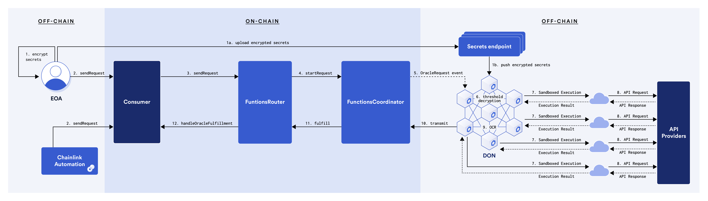
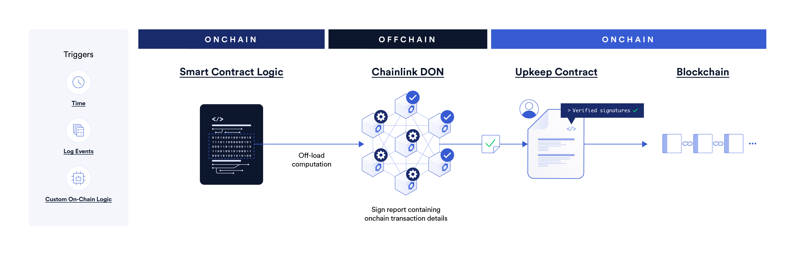

# Oracles

In the world of cryptocurrencies and decentralized finance (DeFi), obtaining off-chain data in a timely and accurate manner is crucial. Smart contracts cannot directly access external systems or data sources, and oracles bridge this gap by bringing information from the outside world into the blockchain. Sofa.org fully utilizes oracles to provide users with trustworthy data services, ensuring transparency and traceability in the settlement process. The ChainLink oracle service, known for its high degree of decentralization, reliability, and adaptability, has been chosen as our primary means of accessing off-chain data.

Every product requires price data for final settlement upon maturity. In our protocol, there are two types of price data. One is the price of the underlying asset at the time of expiration (SmartTrend), and the other is a price that needs to be calculated from historical prices (DNT).

## Price at Expire

Obtaining the current price of an underlying asset on-chain through an oracle is quite common, with many protocols building their applications based on this.
Typically, there are two ways: one is by calling contracts from DEXs like Uniswap to get the Price or Twap Price of the underlying asset, and the other is by obtaining the asset price through Data Feeds provided by an Oracle Service like ChainLink. Considering the need for the Settle Price to be as close as possible to CeFi exchange prices (for ease of hedging by users or market makers) and for security reasons (to avoid manipulation and attacks), we choose ChainLink's Data Feeds as the Oracle for Price at Expire.

## Price from History

For products like DNT, we need to know the highest/lowest price of the Token from the time it was minted to its expiration to calculate the final Payoff. Common on-chain Oracles cannot provide this data, or even if it is theoretically possible, it is not feasible in practice (theoretically, it would require iterating through each price point for statistics, and the prices provided by on-chain oracles are not continuous in time).
So, how do we obtain Price from History? Do we need to deploy our Oracle contract and feed the price ourselves? Wouldn't that make it less decentralized? Thanks to industry development, we can now use ChainLink's Functions product to call off-chain APIs in a decentralized manner and publish the obtained data on-chain through decentralized nodes. Afterwards, we can use this data just like using Data Feeds.

## ChainLink Data Feeds Spot Price Service

To ensure that the settlement price reflects the real market situation, Sofa.org uses ChainLink Data Feeds to obtain spot prices. ChainLink Data Feeds are a set of decentralized data sources that aggregate price information from different exchanges to provide highly accurate and stable asset price data. In this way, our smart contracts can access real-time price data, ensuring that trades and contract executions are based on the latest and fairest market conditions.

## ChainLink Functions Historical Price Service

When determining the value of certain derivatives and financial products, historical price data becomes equally important. For this, we use ChainLink Functions to obtain historical prices from renowned trading platforms like Coinbase. ChainLink Functions is a custom oracle feature that allows smart contracts to call a single API to obtain any required data. With the flexibility provided by ChainLink Functions, we can tailor the way we obtain historical data to support our complex financial logic and product design.

## ChainLink Automation Regular Update Service

To ensure that price information on the blockchain is always up-to-date, Sofa.org utilizes ChainLink Automation to guarantee that prices are automatically updated and pushed to the blockchain on a regular basis. ChainLink Automation (formerly known as ChainLink Keepers) offers a decentralized network where smart contracts can schedule and automatically execute complex tasks, such as regularly updating data, triggering events, or making critical contract adjustments. This automation ensures that the prices on the blockchain always reflect the latest market conditions, providing the necessary real-time data for decentralized applications using our platform.

## Traceability and Decentralization

The entire process of obtaining and using price data is fully decentralized, achieving traceability at the contract level. Our advocacy for transparent processing ensures that every step within the system is open and verifiable by users. Users can view the source of each price update, including the specific data providers and their aggregation logic.

## Continuous Innovation in Oracle Services

Years of practice have proven the reliability and security of ChainLink's oracle services, making them trustworthy. As the industry evolves and new technologies emerge, Sofa.org is also actively exploring and adopting a more diverse range of oracle services. This aims to enhance data security, reduce the risk of reliance on a single service, and ensure that our services keep pace with the latest market developments.

Oracles, as the critical link between the blockchain and the external world, are the foundation for ensuring the reliability of DeFi products. Through a suite of services from ChainLink, combined with other high-quality oracle resources, Sofa.org offers users a robust, transparent, decentralized, and sustainable data acquisition system. This safeguards user interests and ensures the stable operation of the platform.

