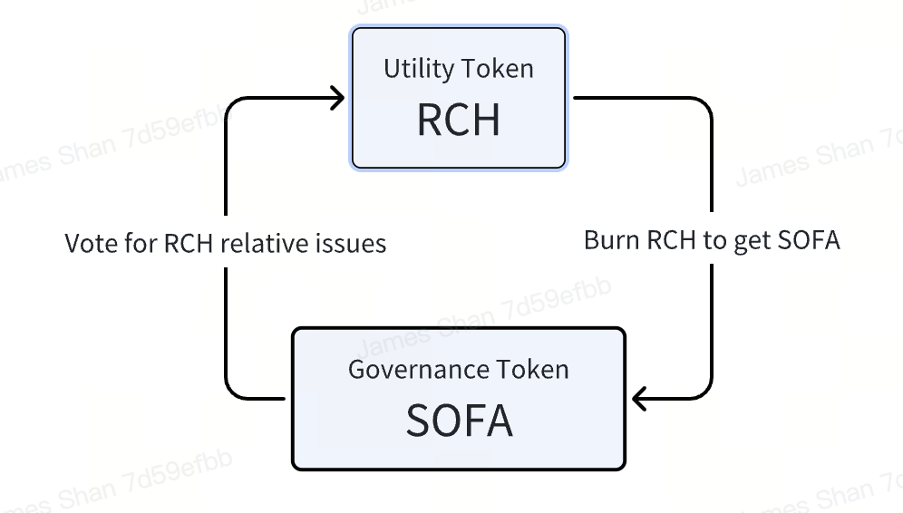

# Dual-token model

As a decentralized, non-profit, open-source technology organization, Sofa.org has meticulously designed a dual-token model for its ecosystem. This model includes a governance token (SOFA) and a utility token (RCH).

