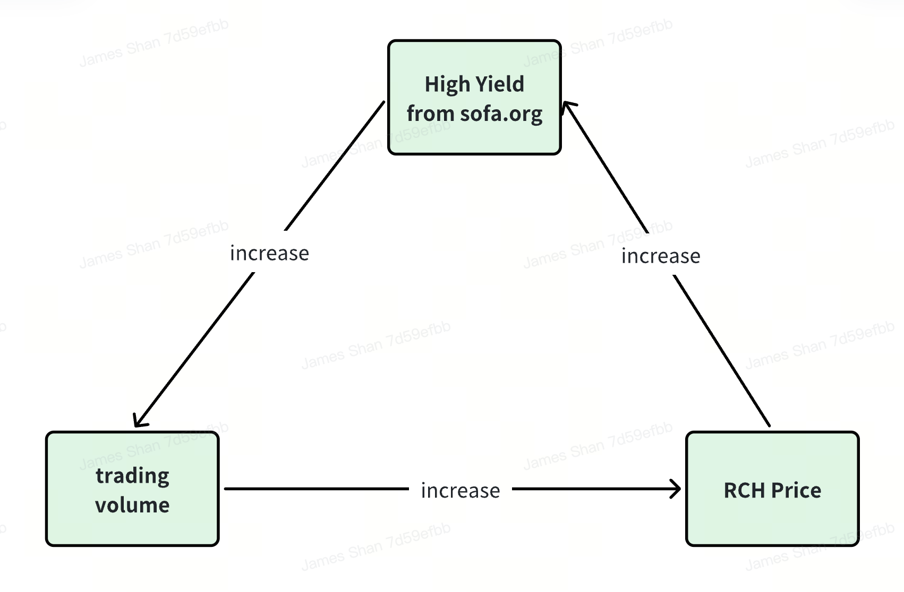

# $RCH

$RCH is the most crucial token within the Sofa.org ecosystem, embodying the entire ecosystem's value. It will achieve a complete fair launch, with no pre-sales and no allocations reserved for the team or investors. The only way to acquire $RCH is by conducting transactions within the Sofa.org ecosystem protocols.

Sofa.org has created a new decentralized settlement system and economic mechanism through $RCH, sharing all potential future profits of the ecosystem with traders:

## The Essence of $RCH: Storing the Value of Transactions Through Deflation

1. The total supply of $RCH is capped at 37,000,000.
2. All fees generated within the Sofa.org ecosystem are used to purchase $RCH on Uniswap's LP and directly burned. As transactions increase, the total supply of $RCH will decrease, making $RCH increasingly scarce. This mechanism stores the value of each transaction into the remaining $RCH through deflation, continuously and permanently increasing the value of each remaining $RCH token.
3. Thanks to its limited supply and continuous deflationary characteristic, as the transaction volume of various protocols within the Sofa.org ecosystem rises, the price of $RCH is expected to surge rapidly.

## How to Obtain $RCH

Every day, a certain amount of $RCH is airdropped as rewards to all participants in transactions, with individuals conducting larger volumes of transactions receiving more $RCH. This mechanism returns the value of transactions back to the traders.

$$
\text{Daily RCH airdrop for a trader}=\dfrac{\text{Daily trading volume made by him/her}}{\text{Total daily trading volume }}\times \text{Daily RCH airdrop distributed to all traders}
$$

## RCH TOKENOMICS

### Basic Vault

Over 60% of $RCH, specifically 25,000,000 (25 million) $RCH, is pre-mined and, along with ETH valued at over $500,000, is placed into Ethereum's Uniswap L3 to form the initial Liquidity Pool (LP). This pool of $RCH and ETH is referred to as the basic vault.

The basic vault is not owned by anyone. After depositing into the LP, the corresponding Uniswap LP tokens are destroyed, ensuring that the liquidity of the basic vault can never be withdrawn. This means that the $RCH available on the market in the future will be far less than what is locked in the LP, making it nearly impossible for the $RCH price to fall below its initial price.

### Airdrop Rewards for Traders

A total of 12,000,000 $RCH will be airdropped to traders within the ecosystem according to a schedule.

Initially, 12,500 $RCH are airdropped daily to traders in the Sofa.org ecosystem, with the number of daily airdropped tokens gradually decreasing, reducing by 20% every 180 days.

| **Days after launch** | **Daily Airdrop** |
| --------------------- | ----------------- |
| 0                     | 12,500            |
| 180                   | 10,000            |
| 360                   | 8,000             |
| 540                   | 6,400             |
| 720                   | 5,120             |
| 900                   | 4,096             |
| 1080                  | 3,276.8           |
| ……                  | ……              |

## $RCH's Strong Risk Resistance and Countercyclical Capability:

### Positive Cycle from the Entire Ecosystem

The higher the price of $RCH, the higher the value of airdrops that traders can receive for trading in the Sofa.org ecosystem, which in turn promotes increased trading volume within Sofa.org. As trading volume increases, more $RCH is burned, leading to a higher price for $RCH.

### Natural Resistance to Volatility

- $RCH is a complete fair launch, with no individual or team holding $RCH at the start, eliminating the risk of sudden large-scale sell-offs.
- The liquidity of the Foundation Vault is locked and cannot be withdrawn, preventing liquidity depletion.
- There is infinite deflation as long as there are transactions on sofa.org.
- When the price falls, the USD transaction fees will purchase more $RCH and burn it, accelerating the reduction in the number of $RCH and stabilizing the price.

## Infinitely Scalable Ecosystem

In the future, any true DeFi project that meets the standards of Sofa.org can apply to join the Sofa.org ecosystem.

### Benefits of Joining the Ecosystem

1. Certification and Promotion by Sofa.org: Projects receive true DeFi certification and promotion from Sofa.org, enhancing their visibility and credibility within the DeFi community.
2. RCH Airdrop for Transactions: Transactions within the project also qualify for $RCH airdrops, rewarding users and incentivizing participation.

### Requirements for Joining the Ecosystem

1. Adherence to True DeFi Standards: Projects must meet the true DeFi standards set forth by Sofa.org, ensuring they align with the ecosystem's principles of decentralization and transparency.
2. Allocation of Fees to Burn $RCH: Projects must allocate all or a portion of their transaction fees to burn $RCH, contributing to the deflationary mechanism and value increase of $RCH.
3. Approval through Collective Voting by $SOFA Holders: Projects must be approved to join the ecosystem through collective voting by $SOFA token holders, ensuring community endorsement and support.

As more protocols join the Sofa.org ecosystem, more transaction fees will be allocated to burn $RCH, increasing its value. This mechanism ensures that traders across all ecosystem protocols receive higher rewards.

Through $RCH, Sofa.org has built a completely neutral token system to serve traders and market makers, returning all value created by transactions to every participating trader in the form of $RCH. We believe this system will lay the foundation for true web3 financial transactions and become an indispensable part of the future web3 financial ecosystem.

