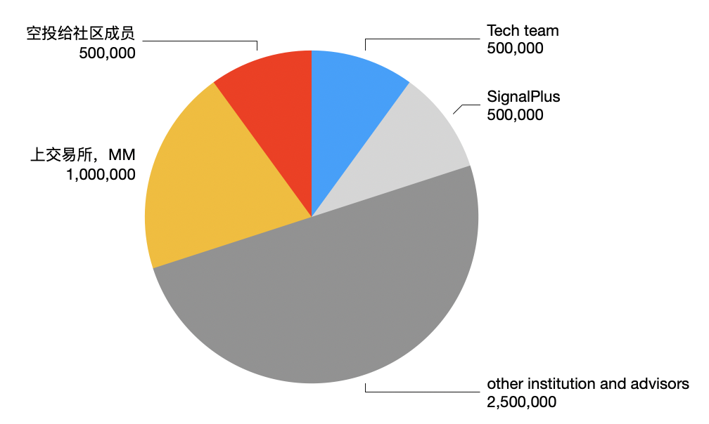

# $SOFA

SOFA 代币是 sofa.org 生态的治理代币。作为去中心化的非盈利开源技术组织，sofa.org 生态的所有决策都由 SOFA 的持有者投票决定。

## SOFA 代币的用途

作为治理代币，SOFA 不会参与生态的收益分成，而是专注于通过去中心的投票治理来维护生态的健康发展，SOFA 用于投票的内容包括并不限于：

1. 支持什么新的理财产品
2. 理财产品/衍生品支持哪些新的币
3. RCH 每日空投在不同的理财产品和币种间怎么分配
4. 哪些新协议能加入生态
5. RCH 每日空投在不同的协议间怎么分配
6. RCH 空投释放速度是否需要调整
7. ……

## 如何获得 SOFA

1. sofa.org 是由 web3 领域里最强大的一批机构联合发起和支持的，这些大型机构作为联合发起方将获得初始的 SOFA 份额以体现各自的投票权；
2. 一部分行业领袖作为 sofa.org 的 advisor 也会获得初始的 SOFA 份额；
3. 一部分 SOFA 将被用于空投给项目初期参与宣传和社区活动的活跃成员；
4. 任何人都可以通过 burn 掉 1 个 RCH 获得 1 个 SOFA。通过主动 Burn RCH 来对生态作出贡献，从而获得 SOFA 所代表的生态投票权。

