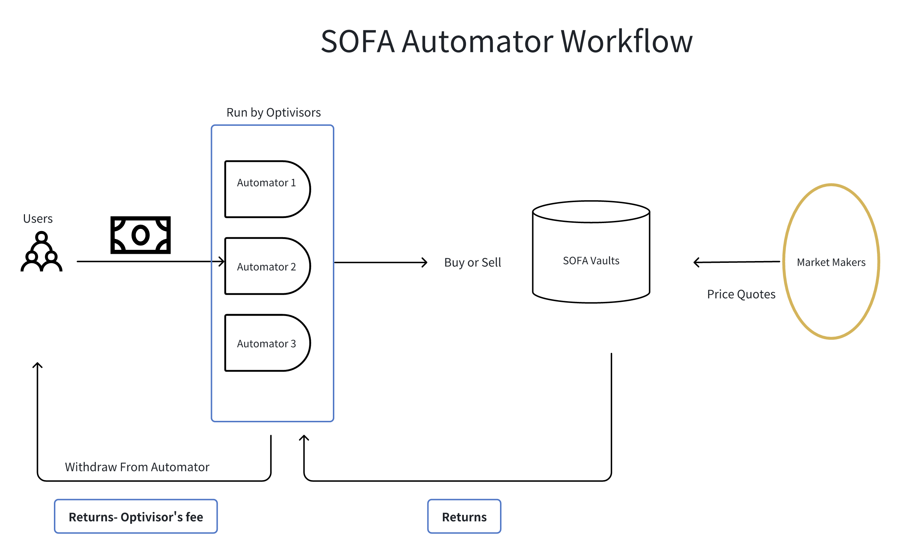

# Automator

## Introduction

In our mission to democratise option trading for the masses, the SOFA team has created **Automator** as an intuitive way for users to earn strategy yields passively.  By leveraging a community of strategy managers, collectively known as **Optivisors, **users are able to participate in their favourite managed strategies in return for sharing a small upside profit fee.  This win-win model will provide decentralized and on-chain access for depositors to earn a variety of high quality returns with an evolving base of community recognized Optivisors.

## Key Automator Features

1. **Community Driven Design.**  The launch of Automator reflects our dedication to community engagement, providing decentralized tools to democratize DeFi options trading journey, while expanding user access to secure yield solutions that will evolve with time.

2. **Intuitive Interface**.  Complex option strategies have been distilled into an intuitive and simple to use interface, while offering full on-chain transparency and strategy disclosure consistent with the DeFi ethos.

3. **Market Agnostic**.  Benefit from volatility movements in either direction, with SOFA products giving Optivisors full strategy flexibility regardless of market outlook.

4. **Substantial Gas Savings**.  Optivisors will be able to 'roll' their on-going strategies on Automator will zero additional gas costs, promoting long-term profitability and sustainability.

## Optivisors: Our Community Strategy Champions

One of Automator’s standout features lies in its community-driven approach.  By engaging the collective wisdom of our DeFi community, strategy creators, aka Optivisors, are able to design, execute, and monitor ongoing SOFA strategies for the benefit of passive depositers.  In return for their expertise, Optivisors will receive a share of the _total_ strategy upside to create a win-win outcome that aligns economic incentives and promotes long-running engagement.

As SOFA continues to expand its product offerings and chain connectivity, Optivisors will play an increasingly important role in our ecosystem as their strategies scale in complexity and reach.  Protocol expansion into additional instruments and CeFi connectivity offer feasible milestones that we can look forward to, and we encourage ongoing community feedback to power us towards the next steps.

## Automator WorkFlow

## Automator FAQ

### A. How does Automator work?

Automator involves three key participants: **Users**, **Optivisors**, and **Market Makers**.

1. **Users**

   Users can select their preferred Automator and deposit tokens. Under the Optivisor’s expertise, the Automator generates returns, which are distributed among participating users. Additionally, users benefit from incentive $RCH token airdrops as part of their participation.

2. **Optivisors**

   Optivisors are responsible for creating Automators and executing trading strategies—such as bullish and bearish positions—by interacting with SOFA Vaults. As a reward for their expertise, Optivisors earn a share of the profits.
   
3. **Market Makers**

   Similar to other SOFA products, Market Makers provide pricing for SOFA Vaults. Optivisors managers leverage these quotes to allocate Automator funds and participate in SOFA Vault strategies. Once these strategies are settled, profits are distributed accordingly.

### B. What fees will I be charged?

The protocol charges a 15% service fee on the profits generated by Automators. If no profit is generated, no service fees are charged.

Optivisors can also set a management fee when creating an Automator. This fee applies only to profits but is recorded as a liability during periods of losses. **The Optivisor can only collect management fees again once the Automator’s cumulative profits turn positive.**

### C. How to become an Optivisor and create an Automator?

Anyone can create an Automator as an Optivisor. However, each address is limited to creating one Automator per chain and deposit token type. To unlock the strategy quota, the Optivisor must burn 500 $RCH tokens.

### D. How about the gas fees within the Automator?

The Optivisor is responsible for covering all gas fees related to transactions executed within the Automator.

### E. How can I withdraw my funds after depositing into an Automator?

Automators function like funds, featuring a redemption lock-up period to manage liquidity and strategy execution. Withdrawals can be initiated anytime but require waiting until the lock-up period ends, which can be up to 30 days, as set by the Optivisor during creation.

### F. What kinds of returns can I expect with an Automator?

Automator returns are composed of three key components:

1. **Interest**

   - Funds deposited into the Automator are automatically staked in low-risk protocols like Aave or Curve, generating passive interest.
   - These returns are updated in real-time and distributed to users based on their share when withdrawing.

2. **Trading PNL**

   - Returns generated from the Optivisor’s trading strategies
   - These returns are reflected only after the trading strategy expires, allowing the Optivisor to claim the positions. Users receive their share upon withdrawal.

3. **$RCH incentive**

   - $RCH token airdrops earned through the Optivisor’s trading activities.
   - Airdrops are distributed daily based on the current holders of the Automator and their respective ownership shares. Users can claim their $RCH tokens directly from the **Claim $RCH** page.

### G. What are the risks associated with using an Automator?

Automators involve risks as the Optivisor manages user funds for options trading and low-risk protocols. The Optivisor decides the balance between using interest earnings or principal for trading, affecting the Automator's risk level. Each Automator has a buffer limit, which can range up to 99.9%, indicating the portion of funds reserved for lower-risk protocols. Users can view the specific buffer for each Automator to select one that aligns with their risk tolerance. SOFA doesn't guarantee risk-free trading, and principal loss is possible. Assess your risk tolerance carefully before participating.

### H. How is the $RCH airdrop generated and distributed to user's account?

$RCH tokens are earned through the Optivisor's trading activities and can be claimed by users afterward, just like in other SOFA Vaults. You can check the $RCH airdrop info here: [https://docs.sofa.org/en/tokenomics/](https://docs.sofa.org/en/tokenomics/)
