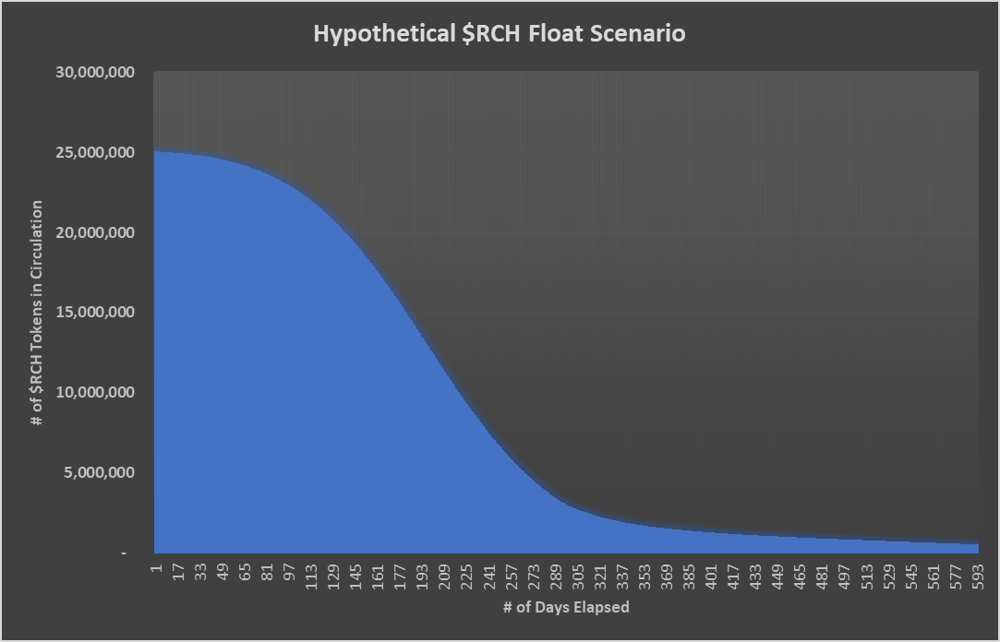
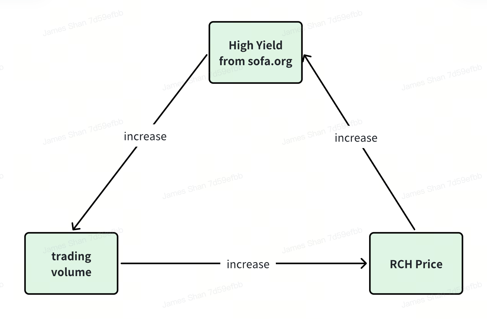
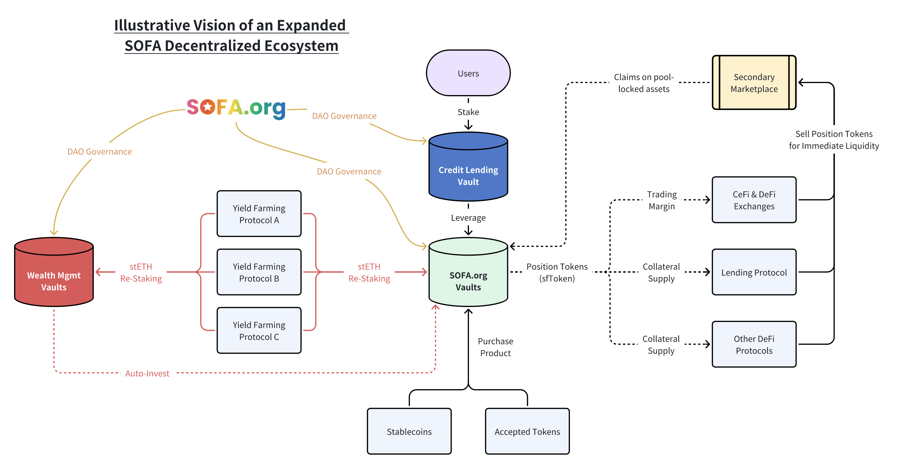

# Hypothetical $RCH Float Scenario (LP + Cumulative Airdrops)

_Base assumptions_

- 0.02% protocol service fee, 1,000,000 USDT in day 1 protocol TVL with 2% daily growth, 12.5k in daily notional $RCH airdrops with 50% sold back into LP pool

## Positive Reflexivity with Self-Correcting Downside Adjustments

Given its deflationary supply model, increased protocol transactions should lead to a higher $RCH price.  **As the utility token's price increases, so does the value of the upcoming airdrops**, which encourages additional transactions and **creates a positive feedback loop for the entire ecosystem.**

On the other hand, should the token price fall precipitously for whatever reason, the **USDT based protocol transaction fees will be able to burn a greater quantity of $RCH** tokens from the daily buyback operations.  This serves as a **powerful, self-correcting adjustment to stabilize the token price**, until the daily transactions can catch-up to resume a net supply deficit and restart the upward $RCH price trajectory.

## No Exit-Liquidity Dumps

Learning from the experience of prior projects, **$RCH's fair launch mechanism will eliminate any negative 'cliff vesting' impacts** or insider liquidity dumps as no party is entitled to any $RCH at launch.  Furthermore, the utility token's **initial liquidity is locked and cannot be withdrawn by its contributors**, ensuring a minimum level of liquidity regardless of market developments.  Finally, as long as protocol transactions continue to happen, this should be a **net deflationary supply impact on $RCH**, granting the token price a very strong tailwind for the long-haul.

## Infinitely Scalable Ecosystem

In the future, any aspiring DeFi project that **meets the standards of SOFA.org can apply to join the ecosystem as a protocol partner**.

## Benefits of Joining the Ecosystem

1. Recommendation by SOFA.org as a DeFi project that observes and upholds the association's decentralized values and design, serving as an expedited pathway to connect with rest of the SOFA ecosystem.
2. Transactions within the greater SOFA ecosystem also qualify for the daily $RCH airdrops.

## Prerequisites for Joining the Ecosystem

1. Adherence to True DeFi Standards:  Projects must meet the true DeFi standards set forth by SOFA.org, supporting the continued growth of the decentralisation mission.
2. Allocation of Fees to Burn the Native Token:  Projects should allocate all or a portion of their transaction fees to burn the $RCH token, contributing to the deflationary mechanism and accelerating the value creep to our loyal users.
3. Approval through Collective Voting by $SOFA Holders:  Projects must be approved to join the ecosystem through a collective voting process by $SOFA token holders as a form of community endorsement.

As more protocols join the SOFA.org ecosystem, more transaction fees will be allocated towards token buybacks, creating profound gains for our token holders.  At the same time, we would also have **succeeded in breaking new grounds on how digital assets can be settled on-chain, while offering a robust tri-party solution for mitigating counterparty risks across both DeFi and CeFi platforms.**
