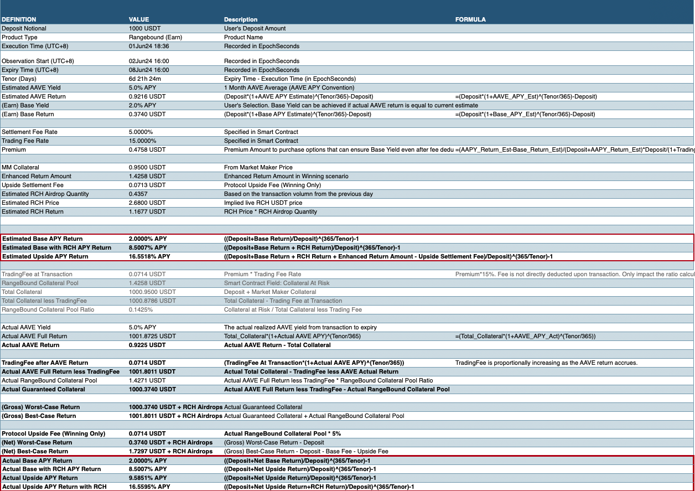
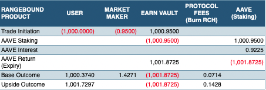

# Frais de Protocole

Chez SOFA, nous nous engageons à créer un écosystème financier juste et transparent où les utilisateurs peuvent acheter démocratiquement une large gamme de produits structurés avec des prix transparents et équitables de la part des teneurs de marché. De plus, **en tant que projet entièrement décentralisé, nous voulons nous assurer que les gains du protocole sont principalement partagés avec nos utilisateurs sous-jacents**, garantissant ainsi un alignement complet des incitations plutôt que des paiements privilégiés à des groupes d'intérêts spéciaux. En tant que tel, nous avons conçu une série de structures de frais avec **une tokenomique de 'lancement équitable' pour garantir une bonne accumulation de valeur et soutenir la longévité à long terme de la plateforme**. Il n'y aura pas de joy-riding de VC ou de dumps de liquidité de sortie au sein de SOFA.

## Frais de Protocole

> 💰 SOFA percevra 15 % de la prime d'option de l'utilisateur en tant que frais de trading de base. De plus, en cas de paiement 'gagnant' pour l'utilisateur, des frais de règlement supplémentaires de 5 % seront facturés sur le total du paiement brut.

## Calculs des Frais

Pour une transparence totale, veuillez consulter l'exemple suivant de la manière dont les frais et les paiements sont calculés dans nos protocoles.

**Définitions :**

$$Premium = Notional_{Deposit} * (1 + AAVE_{1MonthAverage} - BaseYield)^{Full Days/365} - Notional_{Deposit}$$

_Collatéral de MM = Collatéral verrouillé dans le coffre du teneur de marché_

**Fenêtre d'Observation :**

De _16:00 (UTC+8) suivant jusqu'au jour d'expiration 16:00 (UTC+8)_

**Paiements des Utilisateurs à l'Expiration :**

1. Si Knocked-Out

    $$Payoff_{inUSDT} = Notional_{Deposit} + AAVEInterest_{Actual} - Premium * (1 + 0.15)$$

2. Pas Knocked-Out

    $$Payoff_{inUSDT} = Notional_{Deposit} + AAVEInterest_{Actual} + Premium * (1 - 0.15 - 0.05) + MM'sCollateral * (1 - 0.05)$$

### Exemple Numérique (Limité)

### Cascade de Distribution (USDT)

### Rachat de Token Natifs ($RCH)

> **Aligner le succès du protocole avec la performance du Token**

Chez SOFA, nous croyons que la **manière la plus simple d'aligner les incitations des utilisateurs et des détenteurs est à travers les rachats de tokens**, avec $RCH étant notre token utilitaire natif. Nous **nous engageons à ce que tous les revenus du protocole soient exclusivement utilisés pour les rachats de $RCH**, créant ainsi une boucle vertueuse où les gains de prix des tokens sont alimentés par l'utilisation du protocole.

Avec une **offre déflationniste fixe, un calendrier de libération méthodique et des airdrops basés sur l'utilisation, l'accumulation de valeur à long terme pour $RCH est largement fonction des revenus du protocole**, qui est en soi une mesure directe du succès de l'adoption. De plus, avec des **airdrops de tokens exclusivement limités aux utilisateurs et aux supporters du protocole**, nous pouvons nous assurer qu'ils sont les mieux placés pour bénéficier du succès à long terme de SOFA, restant fidèles aux idéaux commerciaux de DeFi de 'redonner' aux véritables utilisateurs de base et aux premiers adoptants.

**La logique de rachat de tokens est une partie intégrante du contrat intelligent du protocole SOFA**. Les administrateurs du protocole déclencheront régulièrement ce processus pour acheter et brûler des $RCH avec les revenus du protocole via des plateformes DEX soutenues. Les $RCH détruits ne seront plus en circulation, et le montant total de $RCH diminuera progressivement au fil du temps avec l'augmentation de l'utilisation du protocole.

Plus de détails sur notre modèle de Tokenomics seront abordés dans sa propre section dédiée ci-dessous.