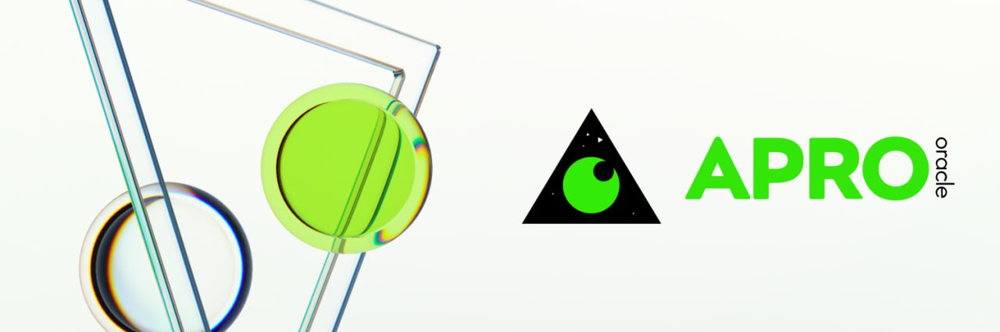
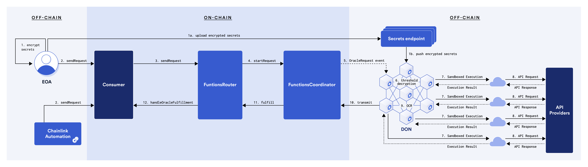
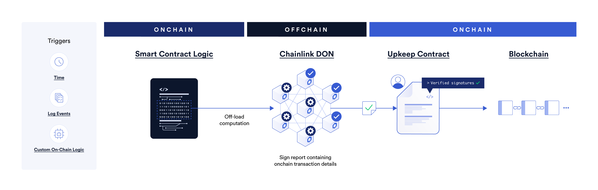

# Oracle Construction

Dans le monde des cryptomonnaies et de la DeFi, **l'obtention de données hors chaîne de manière rapide et précise est cruciale.** Comme les contrats intelligents ne peuvent pas accéder directement aux systèmes externes ou aux sources de données, les oracles servent à combler cette lacune en apportant des informations externes sur la blockchain. Le service de données fiable doit être fourni pour garantir une transparence et une traçabilité complètes dans le règlement, tout en minimisant les éventuels litiges.

Le service oracle **ChainLink**, connu pour son haut degré de décentralisation, de fiabilité et d'adaptabilité, a été choisi comme principal moyen d'accès aux données hors chaîne pour SOFA. De plus, l'utilisation des flux de prix ChainLink présente le **bénéfice supplémentaire de protéger le protocole contre les 'attaques de prêts flash'**, tandis que **la source des flux de données proviendra de plateformes de trading réputées telles que Coinbase** pour garantir l'intégrité des données.

SOFA utilise [APRO Oracle](https://www.apro.com) pour protéger nos actifs sur plusieurs chaînes. Le soutien et la protection d'**APRO Oracle** nous permettent de maintenir la stabilité et la sécurité de nos actifs sur chaîne. Pour plus d'informations, veuillez consulter la [documentation d'APRO Oracle](https://docs.apro.com/en).

## Prix Spot / Prix à l'Échéance

L'obtention du prix actuel d'un actif sous-jacent sur chaîne via un oracle se fait généralement de deux manières :

- appeler des contrats de DEX comme Uniswap pour obtenir le prix ou le prix TWAP de l'actif sous-jacent
- obtenir le prix de l'actif via des flux de données fournis par un service oracle comme ChainLink

Considérant la nécessité que le prix de règlement soit aussi proche que possible des prix des échanges CeFi (pour faciliter la couverture par les utilisateurs ou les teneurs de marché) et pour des raisons de sécurité (pour éviter la manipulation et les attaques), nous avons **choisi les flux de données de ChainLink comme source oracle pour notre prix à l'échéance**.

Avec les sources de données décentralisées de ChainLink qui agrègent les informations de prix provenant de différentes bourses, nous garantissons que l'exécution de nos contrats intelligents est basée sur des ensembles de données de prix à jour, fiables et les plus équitables disponibles publiquement.

## Prix Calculé Dérivé des Clôtures Historiques

Pour des produits comme Rangebound, il est nécessaire de connaître les prix les plus élevés et les plus bas du jeton sous-jacent depuis la création jusqu'à l'échéance afin de calculer le paiement final. Les oracles sur chaîne communs ne peuvent généralement pas fournir ces données, étant donné que les oracles sur chaîne ne fournissent pas de données en série temporelle continue.

Au lieu de déployer nos propres contrats oracle comme un compromis de centralisation (commun), nous avons trouvé une solution dans le **produit Functions de ChainLink**. Grâce aux dernières innovations, nous sommes en mesure d'appeler des API hors chaîne de manière décentralisée et de publier les données obtenues sur chaîne via des nœuds décentralisés comme un flux de données typique.

## Service de Mise à Jour Automatique Régulière

SOFA utilise ChainLink Automation pour garantir que les prix sont automatiquement mis à jour et poussés vers la blockchain de manière régulière. ChainLink Automation offre un réseau décentralisé où les contrats intelligents peuvent planifier et exécuter automatiquement des tâches complexes, y compris des mises à jour de données par intervalles, des événements déclencheurs et même des ajustements critiques de contrats. Cela **garantit que les prix sur chaîne restent constamment à jour et offre une confiance dans les données au réseau dApps connectées de SOFA**.

## Décentralisation et Traçabilité

Rester fidèle à notre esprit DeFi, **le processus de récupération des données de prix de SOFA sera toujours entièrement décentralisé**, offrant une traçabilité d'audit complète au niveau du contrat. Notre plaidoyer pour un traitement transparent garantit que chaque étape du système est ouvertement vérifiable par les utilisateurs, avec des détails sur les données de prix tels que la source du fournisseur et la logique d'agrégation entièrement observables à tout moment.

## Innovation Continue dans les Services Oracle

Alors que ChainLink reste une référence en matière de fiabilité des données DeFi, SOFA explore en permanence et se tient informé des dernières innovations dans les services oracle. Nous sommes conscients de la dépendance excessive à des sources de fournisseurs limitées et nous **nous efforcerons de diversifier nos entrées de protocole autant que technologiquement possible**.

À long terme, SOFA s'efforce d'offrir aux utilisateurs un système d'acquisition de données robuste, transparent, décentralisé et durable qui puisse protéger les intérêts des utilisateurs tout en garantissant la longévité opérationnelle.