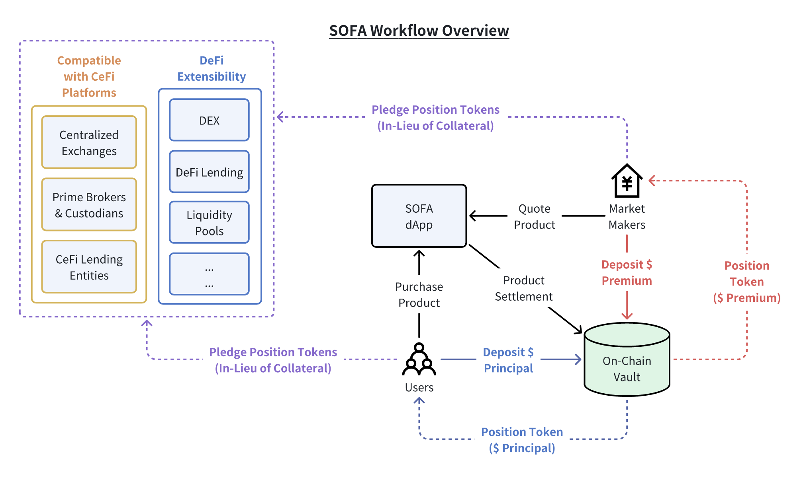

## 製品範囲

SOFAプロトコルは**最初に暗号構造商品を決済およびトークン化することに焦点を当てます**。私たちは「あまり知られていない道」を選び、最も複雑な商品に最初に取り組むことで、成功した展開が他のすべての暗号資産クラスへの迅速な拡大をもたらすことを目指しています。SOFAプロトコルは**Ethereumおよび他のL1 EVMブロックチェーン**で開始されます。

## プロトコルワークフロー

SOFAを介した典型的な取引実行の高レベルな概要は以下の通りです：

- 参加する機関市場メーカーは、構造商品の実行可能な価格をプロトコルのdAppに継続的にストリーミングします
- ユーザーは表示された価格に基づいて特定の構造商品購入を選択し、実行します
- ユーザーのコミットされた資産は、商品のDeFiボールトに送信され、ロックされます
- 市場メーカーの最大プレミアムエクスポージャーもボールトに送信され、ロックされます
  - _注：この時点でいずれかの側が必要な資産を提示しなかった場合、取引は実行されません_
- 対応するポジショントークンの請求（資産の詳細を参照）がユーザーと市場メーカーの両方にミントされ、従来のERC-20トークンのように自由に他のウォレット宛に転送可能です

- **「Earn」構造の場合のみ、**ボールト内の担保はCompound、AAVEなどの成熟した安全な利回り獲得プロトコルにステークされ、ユーザーのために基本的な利息を獲得します
  - このステップには特に注意が払われ、適格な行き先はガバナンストークン保有者によって投票されます

- 最後に、商品が満了すると、関連する支払いがリリースされ、ユーザーと市場メーカーの両方がボールトで請求可能になります
  - 各ポジショントークンが新しいウォレットに転送された場合、アドレスの所有者は満了後いつでも資産を請求できるようになります

## トークン標準 (ERC-1155)

**SOFAプロトコルは、ERC-1155マルチトークン標準を介してユーザーのチェーンロックされたポジションをトークン化し、[満了日]、[基準価格]、[メーカー/テイカー切替]、および対象となる金融商品に関連するその他のフィールドなどの重要なポジション詳細を記録します**。

従来の単一資産トークン標準と比較して、ERC-1155は単一の契約内で複数の種類のトークンを作成および管理することを可能にし、各トークンタイプが異なる特性を持つことをサポートします。同じパラメータを持つポジションは、標準のERC-20トークンと同様に便利に転送できる一方で、マージまたはスプリットすることも可能です。**この革新は、広範な資産互換性、高い柔軟性、およびガス効率のバランスを取ります**。

同じストライク価格と満了時間を持つポジショントークンは、標準トークンのように代替可能であり、単一の操作でバッチ決済が可能で、 significantなガス節約を実現します。