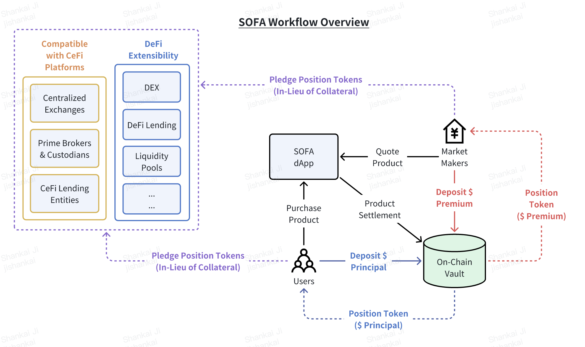
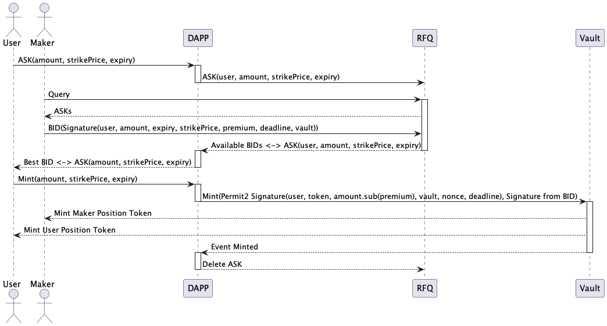
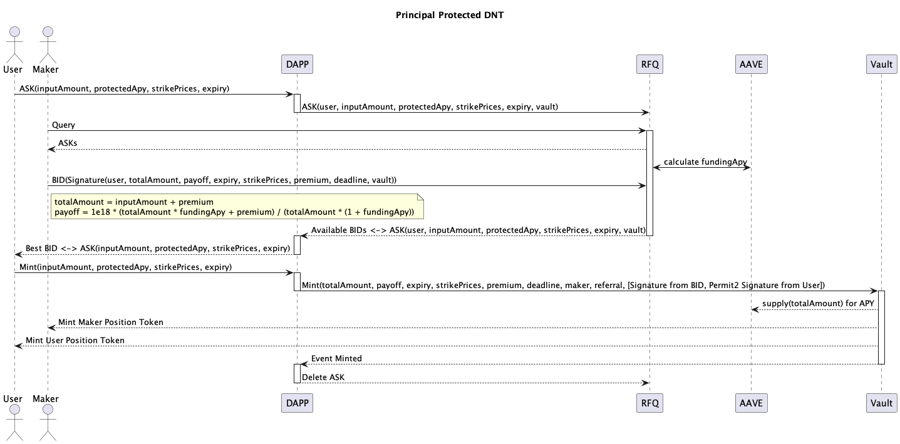
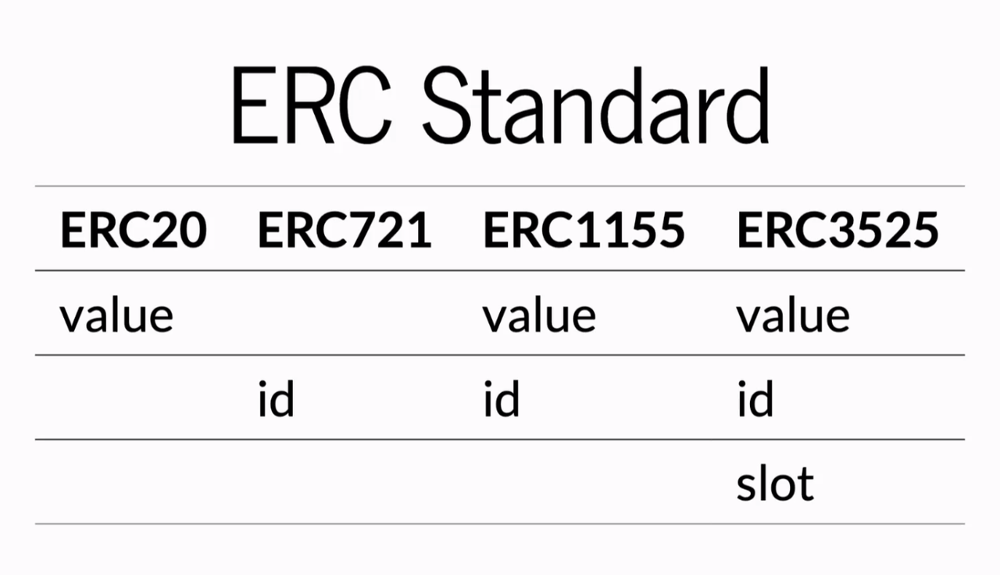
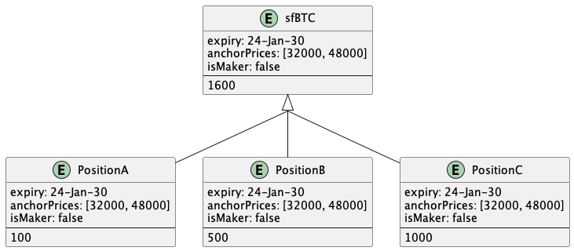

## Productum Ambitum

Protocolum SOFA **initio in stabilendis et tokenizandis productis structuris crypto versabitur** ut nostra probatio conceptus. Iter 'minus pervium' capimus ad primum complexissimas productas oppugnandas, ubi prospera exsecutio celerem expansionem in omnes alias classes crypto bonorum videbit. Protocolum SOFA **in Ethereum et aliis L1 EVM blockchainibus** ad initium lanched.

## Protocolum Laboris Fluxus

Summarium altum exsecutio commercii typici per SOFA sequitur:

- Participantes institutionalium mercatus facientes continuas pretia exsecutabilia in productis structuris ad dApp protocolum fluunt
- Usor eliget et exsecutur emptio particularis producti structuri secundum pretium ostentum
- Bona compromissa usoris mittuntur et in vault DeFi producti clauduntur
- Maxima premium exposita mercatus facientis etiam mittitur et in vault clauditur
  - _Nota: transactio non exsecutur si utraque pars non sua bona requirenda ad hanc punctum ponit_
- Correspondentes Position Tokens iura (referentia ad bona details) erunt ad utrumque usorem et mercatum facientem, libere transferibilia sicut quilibet conventionalis ERC-20 token ad quamlibet aliam destinationem nummariam

- **Pro structuris 'Merere' tantum,** collateralis in vault in maturis et tutis protocolis mercedis sicut Compound, AAVE et cetera stabulabitur ad mercedem basim usoribus
  - Extra diligens scrutinio in hoc gradu impendetur, cum destinationibus eligibilibus a possessores Governance Token suffragatis

- Denique, post expirationem producti, relevantis solutio dimittetur et in vault a utroque usu et mercatu faciente reclamabilis erit
  - Si respective Position Tokens ad novum nummarium transferantur, dominus inscriptionis poterit potius bonum reclamare quovis tempore post expirationem

## Token Standards (ERC-1155)

**Protocolum SOFA tokenizat positiones usorum in catena-clusis per standardum multi-token ERC-1155, vitales positionis details ut [Expirationem], [Pretium Anchor], [Maker/Taker Toggle], et alia campa relevantia instrumenti in quaestionem recordans**.

Comparatum ad conventionales standards token singularis bonorum, ERC-1155 creatio et administratio plurium generum tokenorum intra unam contractum permittit, cum subsidio pro quolibet genere token habentibus diversas proprietates. Positiones cum eadem parametris adhuc coniungi vel dividi possunt, dum transferentur tam commode quam standard ERC-20 tokens. **Haec innovatio aequilibrium inter latam compatibilitatem bonorum, altam flexibilitatem, et efficientiam gasorum constituit**.

Position Tokens cum eodem Pretio Strike et Tempore Expirationis fungibiles sunt sicut quilibet standard token, et in una operatione batch solvuntur ad significantes gasum servationes permittere.