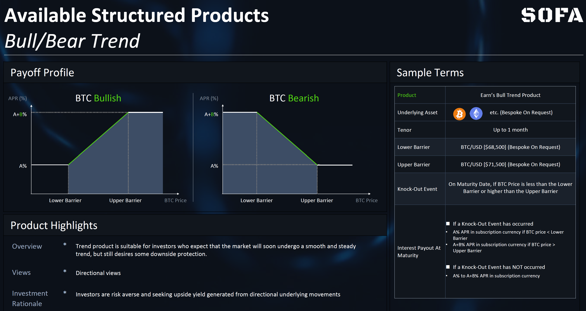
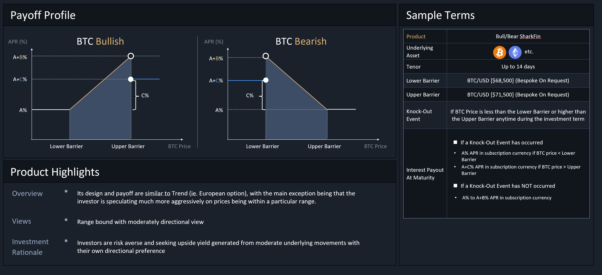

# Classificatio Vault

Contractus Vault usum facit standardi ERC-1155 ad **sustentandum fungibilitatem Positionum Token cum eodem pretio et tempore expirationis**. Tokens cum diversis pretia vel tempore expirationis habebunt diversas ID Token (id est, sicut NFT) dum adhuc continentur sub eodem contractu Vault.

Protocolum SOFA designatum est cum flexibilitate **ad sustentandum quocumque genere producti structi et denominationis collateralis**, quamvis distinctio facienda sit an productum subiectum contineat 'protectionem principalem' vel non.  Ita, nostra **designatio Vault in 2 maiores, auto-explicativas categorias productorum vocatas 'Earn' et 'Surge' dividitur**.

Exemplum Taxonomiae Vault ad SOFA Launch

## Producta Disponibilia ad Launch

Ut nostra inauguralis probatio conceptus, initio in tres populares structuras productorum vocatas **'Rangebound' et 'Trend'** focus habebimus. Praeterea, omnia haec producta sunt disponibilia in protocolis Earn vel Surge.  Insuper, additional producta genera continue addentur secundum postulationem usorum et responsionem ecosystematis.

## Producta Rangebond

### Overview Producti

Producta Rangebound sunt genus producti structi basati in limitibus pretiorum. **Depositores lucrari possunt si res subiecta non tangit limites praestitutos durante periodo observationis ante maturitatem**.  Haec producta apta sunt usoribus qui exspectant mercatum manere in statu consolidationis lateralis cum subiecta volatilitate.

Referens ad diagramma lucri infra, usor credit BTC inter spatium definitum a limitibus inferioribus et superioribus haesurum esse, sed non vult multum detrimenti incurrere etiam si visio falsa sit.  Productum Rangebound usori minimum fructum basem (A) garantizabit etiam si pretium Range ex utraque parte eruptione fiat, sed usor ius habebit ad extra lucrum aequivalens (A+B) si pretia intra limites contineantur.

Ad optiones customizationis, **usor liber est ad latitudinem spatii pretiorum iuvare, quod diversum profilium fructuum basium et superiorum afferet secundum gradus electos**.  Naturaliter, specificando angustius spatium pretiorum, bet magis aggressivum in volatilitate humilis repraesentat, quod ad superiores reditus ducit.  Contrario, latior spatium pretiorum excessus lucrum minuet in commutatione maioris probabilitatis vincendi.  Denique, ad facilitatem administrationis, productum potest specificari ut 're-rolled' automatice ad maturitatem ut bet continuationis ad posterioris protocoli upgrade. (Functione 're-roll' in proximo gradu upgrade explicabitur).

## Producta Trend

### Overview Producti

**Productum Trend aptum est pro depositariis qui exspectant mercatum mox lenem et stabilis trend subire, sed adhuc aliquod detrimentum protectionis desiderant**.  Definendo tam limitum inferiorum quam superiorum pretiorum, usores incipiant lucrum accrescere statim cum instrumentum subiectum limitem pretiorum initialem transierit, cum augendis solutionibus usque ad maximum ad secundum limitum.

Praeterea, dissimile productum Rangebound, productum Trend tantum observat tempore solutionis an pretium rei subiectae intra constitutum spatium cadat ad determinandum ultimum lucrum (id est, optio Europaea).  **Hoc productum praesto est per ambas expressiones Bullish et Bearish**.

Ut exemplum, si usor bullish in BTC est et praedicit quod in proximis septem diebus, pretium BTC super $68,500 manebit sed non excedet $71,500, possunt eligere emere productum Bull Trend, statuendo $68,500 ut limitis inferioris et $71,500 ut limitis superioris spatii lucri.  Referens ad diagramma infra, tempore solutionis, usor erit eligibilis ad solutionem inter fructum basem (A) et limitis superioris (A+B), secundum quid pretium BTC sit tempore.

### Scenaria Applicabilia

The product might be **aptum pro depositariis qui credunt rem esse validam reactionem ad certum eventum oeconomicum, sed etiam solliciti sunt de periculo declinationis pretii si errent** in sua praedictione mercatus.

For example, the user might desire to speculate on BTC prices on the next FOMC decision, the having event, or the next ETF approval announcement.  This strategy is **aptum pro usoribus tenentibus validam convictionem mercatus in his rebus maximis sed periculosis, et vult manere disciplinatum in administrando damna inferiora** si eius vis falsa evadat.

## Shark Fin (Pro Postea)

### Product Overview

Compared to Rangebound and Trend products, the 'Shark Fin' product is relatively more well-known in TradFi markets thanks to its memorable moniker.  Its design and payoff are similar to Trend (ie. European option), with the **principalis exceptio esse quod depositarius multo magis audacter speculat in pretia esse intra certum spatium**.

Said in another way, the Shark Fin product **adoptat conservativam opinionem de volatilitate mercatus per sacrificandum maiorem ascensum in magno motu mercatus, in retributione pro magis audacibus lucris intra inferiores limites pretii**.

As example, let's say an user is bullish on BTC, but holds a high conviction that it will not breach a certain upper bound at some strong technical resistance level.  In such a scenario, the user can choose to buy a Bullish Shark Fin product with a payoff profile as per the diagram below.  At product settlement, the user will receive a return ranging from (A) to (A+B) depending on where spot BTC is; however, unlike in Trend products, note that the return _decrescit_ ad (A+C) upon a breach of the upper price barrier, offering a trade-off in exchange for more aggressive profits in the preceding range.

