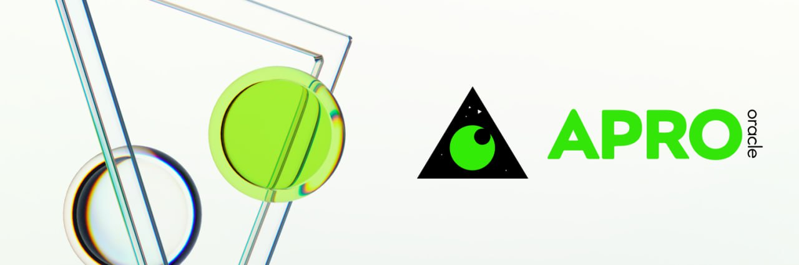

# Oracle Construction

В мире криптовалют и DeFi, **получение оффчейн данных своевременно и точно имеет решающее значение.** Поскольку смарт-контракты не могут напрямую получать доступ к внешним системам или источникам данных, оракулы служат для преодоления этого разрыва, предоставляя внешнюю информацию на блокчейн. Должен быть предоставлен надежный сервис данных, чтобы обеспечить полную прозрачность расчетов и отслеживаемость, минимизируя возможные споры.

Сервис оракулов **ChainLink**, известный своей высокой степенью децентрализации, надежности и адаптивности, был выбран в качестве основного средства доступа SOFA к оффчейн данным. Более того, использование ценовых потоков ChainLink имеет **дополнительное преимущество защиты протокола от 'атаки с использованием флеш-кредитов'**, в то время как **источник ценовых потоков будет из авторитетных торговых платформ, таких как Coinbase**, чтобы обеспечить святость данных.

SOFA использует [APRO Oracle](https://www.apro.com) для защиты наших активов на нескольких цепочках. Поддержка и защита от **APRO Oracle** позволяют нам поддерживать стабильность и безопасность наших активов на блокчейне. Для получения дополнительной информации, пожалуйста, обратитесь к [документации APRO Oracle](https://docs.apro.com/en).

## Спотовая цена / Цена на момент истечения

Получение текущей цены базового актива на блокчейне через оракул обычно осуществляется одним из двух способов:

- вызов контрактов с DEX, таких как Uniswap, для получения цены или TWAP цены базового актива
- получение цены актива через ценовые потоки, предоставляемые сервисом оракулов, таким как ChainLink

Учитывая необходимость, чтобы цена расчетов была как можно ближе к ценам CeFi бирж (для удобства хеджирования пользователями или маркет-мейкерами) и по соображениям безопасности (чтобы избежать манипуляций и атак), мы **выбрали ценовые потоки ChainLink в качестве источника оракула для нашей цены на момент истечения**.

С децентрализованными источниками данных ChainLink, которые агрегируют информацию о ценах с различных бирж, мы гарантируем, что выполнение наших смарт-контрактов основано на актуальных, надежных и самых справедливых наборах данных о ценах, доступных публично.

## Рассчитанная цена, полученная из исторических закрытий

Для таких продуктов, как Rangebound, необходимо знать самые высокие и низкие цены базового токена с момента его создания до истечения, чтобы рассчитать окончательный платеж. Обычные данные на блокчейне обычно не могут предоставить эту информацию, поскольку оракулы на блокчейне не предоставляют непрерывные временные ряды данных.

Вместо развертывания собственных контрактов оракула в качестве (обычного) компромисса централизации, мы нашли решение в **продукте ChainLink's Functions**. Благодаря последним инновациям мы можем вызывать оффчейн API децентрализованным образом и публиковать полученные данные на блокчейне через децентрализованные узлы, как это делается в типичном ценовом потоке.

## Автоматизированный регулярный сервис обновления

SOFA использует ChainLink Automation, чтобы гарантировать, что цены автоматически обновляются и регулярно передаются на блокчейн. ChainLink Automation предлагает децентрализованную сеть, где смарт-контракты могут планировать и автоматически выполнять сложные задачи, включая обновления данных по интервалам, триггерные события и даже критические корректировки контрактов. Это **обеспечивает постоянное обновление цен на блокчейне и предлагает уверенность в данных для сети связанных dApp SOFA**.

## Децентрализация и отслеживаемость

Оставаясь верными нашему основному духу DeFi, **процесс получения ценовых данных SOFA всегда будет полностью децентрализованным**, предлагая полную аудиторскую отслеживаемость на уровне контракта. Наша защита прозрачной обработки гарантирует, что каждый шаг в системе открыто проверяем пользователями, с деталями данных о ценах, такими как источник поставщика и логика агрегации, которые всегда полностью наблюдаемы.

## Непрерывные инновации в сервисах Oracle

Хотя ChainLink остается золотым стандартом надежности данных DeFi, SOFA постоянно исследует и следит за последними инновациями в сервисах ораклов. Мы осознаем чрезмерную зависимость от ограниченных источников поставщиков и **будем стремиться диверсифицировать наши протокольные входы настолько, насколько это возможно с технологической точки зрения**.

В долгосрочной перспективе SOFA стремится предложить пользователям надежную, прозрачную, децентрализованную и устойчивую систему получения данных, которая может защитить интересы пользователей, обеспечивая при этом долговечность операций.