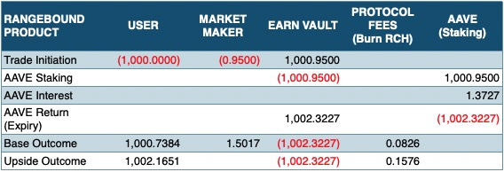

# Protocol Fees

At SOFA, we are committed to creating a fair and transparent financial ecosystem where users can democratically purchase in a wide gamut of structured products with transparent and fair pricing from market makers.  Furthermore, **as a fully decentralized project, we want to ensure that any protocol gains are primarily shared with our underlying users**, ensuring full incentive alignment rather than privileged payouts to special interest groups.  As such, we have devised a series of fee structures with **'fair-launch' tokenomics to ensure proper value-accrual and support long-term platform longevity**.  There will be no VC joy-riding or exit-liquidity dumps within SOFA.

## Protocol Fees

> 💰 SOFA will collect 15% of the user's option premium as a base trading fee.  Furthermore, in the event of a 'winning' payout occurring for the user, a further 5% settlement fee will be charged against the total Gross Upside Payout.

## Fee Calculations

For full transparency, please see the following example of how fees and payoffs are calculated in our protocols.

**Definitions:**

$$Premium = Notional_{Deposit} * (1 + AAVE_{1MonthAverage} - BaseYield)^{Full Days/365} - Notional_{Deposit}$$

_MM's Collateral = Vault-Locked Collateral from Market Maker _

**Observation Window:**

From the _next 16:00 (UTC+8) to Expiry Day 16:00 (UTC+8)_

**User Payoffs at Expiry:**

1. If Knocked-Out

    $$Payoff_{inUSDT} = Notional_{Deposit} + AAVEInterest_{Actual} - Premium + Notional_{Deposit}$$

2. No Knocked-Out

    $$Payoff_{inUSDT} = Notional_{Deposit} + AAVEInterest_{Actual} - Premium * (1 - 0.15 - 0.05) + MM'sCollateral * (1 - 0.05)+ Notional_{Deposit}$$

### Numerical Example (Rangebound)

| **DEFINITION**                              | **VALUE**                         | **FORMULA**                                                                                    |
| ------------------------------------------- | --------------------------------- | ---------------------------------------------------------------------------------------------- |
| Deposit Notional                            | 1000 USDT                         |                                                                                                |
| Product Type                                | Rangebound (Earn)                 |                                                                                                |
| Execution Time (UTC+8)                      | 01Jun24 18:00                     |                                                                                                |
| Observation Start (UTC+8)                   | 02Jun24 16:00                     |                                                                                                |
| Expiry Time (UTC+8)                         | 08Jun24 16:00                     |                                                                                                |
| Tenor (Days)                                | 6.92 days                         | Expiry Time - Execution Time                                                                   |
| Estimated AAVE Yield                        | 5.0% APY                          | 1 Month AAVE Average (AAVE APY Convention)                                                     |
| Estimated AAVE Return                       | 0.9250 USDT                       | (Deposit*(1+AAVE_APY_Est)^(Tenor/365)-Deposit)                                                 |
| (Earn) Base Yield                           | 2.0% APY                          | Estimated                                                                                      |
| (Earn) Base Return                          | 0.3753 USDT                       | (Deposit*(1+Base_APY_Est)^(Tenor/365)-Deposit)                                                 |
| Premium                                     | 0.5497 USDT                       | AAVE_APY_Return_Est-Base_Return_Est                                                            |
| Enhanced Amount (MM Collateral)             | 0.9500 USDT                       | From Market Maker Price                                                                        |
| Estimated RCH Airdrop Quantity              | 0.4357                            | Based on the transaction volumn from the previous day                                          |
| Estimated RCH Price                         | 2.6800 USDT                       | Implied live RCH USDT price                                                                    |
| Estimated RCH Return                        | 1.1677 USDT                       | RCH Price * RCH Airdrop Quantity                                                               |
|                                             |                                   |                                                                                                |
| **Estimated Base APY Return**               | **2.0000% APY**                   | **((Deposit+Base Return)/Deposit)^(365/Tenor)-1**                                              |
| **Estimated Upside APY Return**             | **14.0418% APY**                  | **((Deposit+Base Return + RCH Return + Enhanced Amount)/Deposit)^(365/Tenor)-1**               |
|                                             |                                   |                                                                                                |
| TradingFee at Transaction                   | 0.0824 USDT                       | Premium*15%. Fee is not directly deducted upon transaction. Only impact the ratio calculation. |
| RangeBound Collateral Pool                  | 1.4997 USDT                       | Smart Contract Field: Collateral At Risk                                                       |
| Total Collateral                            | 1000.9500 USDT                    | Deposit+MM_Collateral                                                                          |
| Total Collateral after TradingFee           | 1000.8676 USDT                    | Total_Collateral - TradingFee_At_Transaction                                                   |
| RangeBound Collateral Pool Ratio            | 0.1498%                           | Smart Contract Field: Collateral At Risk Ratio                                                 |
|                                             |                                   |                                                                                                |
| Actual AAVE Yield                           | 7.5% APY                          |                                                                                                |
| Actual AAVE Full Return                     | 1002.3227 USDT                    | Total_Collateral*(1+AAVE_APY_Act)^(Tenor/365)                                                  |
| **Actual AAVE Return**                      | **1.3727 USDT**                   | Actual AAVE Full Return - Total_Collateral                                                     |
|                                             |                                   |                                                                                                |
| **TradingFee after AAVE Return**            | **0.0826 USDT**                   | TradingFee is proportionally increasing as the AAVE return accrues.                            |
| **Actual AAVE Full Return less TradingFee** | **1002.2401 USDT**                | Actual_Total_Collateral-TradingFee_After_AAVE_Return                                           |
| Actual RangeBound Collateral Pool           | 1.5017 USDT                       | Actual AAVE Full Return less TradingFee * RangeBound Collateral Pool Ratio                     |
| **Actual Guaranteed Collateral**            | **1000.7384 USDT**                |                                                                                                |
|                                             |                                   |                                                                                                |
| **(Gross) Worst-Case Return**               | **1000.7384 USDT + RCH Airdrops** | Actual Guaranteed Collateral                                                                   |
| **(Gross) Best-Case Return**                | **1002.2401 USDT + RCH Airdrops** | Actual Guaranteed Collateral + Actual RangeBound Collateral Pool                               |
|                                             |                                   |                                                                                                |
| **Protocol Upside Fee (Winning Only)**      | **0.0751 USDT**                   | Actual RangeBound Collateral Pool * 5%                                                         |
| **(Net) Worst-Case Return**                 | **0.7384 USDT + RCH Airdrops**    | (Gross) Worst-Case Return - Deposit                                                            |
| **(Net) Best-Case Return**                  | **2.1651 USDT + RCH Airdrops**    | (Gross) Best-Case Return - Deposit - Base Fee - Upside Fee                                     |
| **Actual Base APY Return**                  | **3.9721% APY**                   | **((Deposit+Return_Base_Net)/Deposit)^(365/Tenor)-1**                                          |
| **Actual Upside APY Return**                | **12.0896% APY**                  | **((Deposit+Return_Upside_Net)/Deposit)^(365/Tenor)-1**                                        |

### Distribution Waterfall (USDT)

| RANGEBOUNDPRODUCT    | USER         | MARKET MAKER | EARN VAULT   | PROTOCOL FEES(Burn RCH) | AAVE(Staking) |
| -------------------- | ------------ | ------------ | ------------ | ----------------------- | ------------- |
| Trade Initiation     | (1,000.0000) | (0.9500)     | 1,000.9500   |                         |               |
| AAVE Staking         |              |              | (1,000.9500) |                         | 1,000.9500    |
| AAVE Interest        |              |              |              |                         | 1.3727        |
| AAVE Return (Expiry) |              |              | 1,002.3227   |                         | (1,002.3227)  |
| Base Outcome         | 1,000.7384   | 1.5017       | (1,002.3227) | 0.0826                  |               |
| Upside Outcome       | 1,002.1651   |              | (1,002.3227) | 0.1576                  |               |

### Native Token ($RCH) Buyback

> **Aligning protocol success with Token performance**

At SOFA, we believe that the** most straight-forward way to align user and hodler incentives are through token buybacks**, with $RCH being our native utility token.  We will **commit all protocol income to be exclusively used for $RCH buybacks**, creating a virtuous loop of token price gains being driven off protocol usage.

With a **fixed deflationary supply, methodical release schedule, and usage-driven airdops, the long-term value accretion for $RCH is largely a function of protocol revenue,** which in itself is a direct measure of adoption success.  Furthermore, with **Token airdrops exclusively limited to protocol users and supporters**, we can ensure that they stand best to benefit from SOFA's long-term success, staying true to DeFi's commerical ideals of 'giving back' to true core users and early adopters.

**The token buyback logic is an integral part of the SOFA protocol smart contract**.  Protocol administrators will regularly trigger this process to purchase and burn $RCH with protocol revenue through supported DEX venues.  Destroyed $RCH will be no longer enter circulation, and the total amount of $RCH will gradually decrease over time on rising protocol usage.

More details of our Tokenomics model will be covered in its own dedicated section below.
