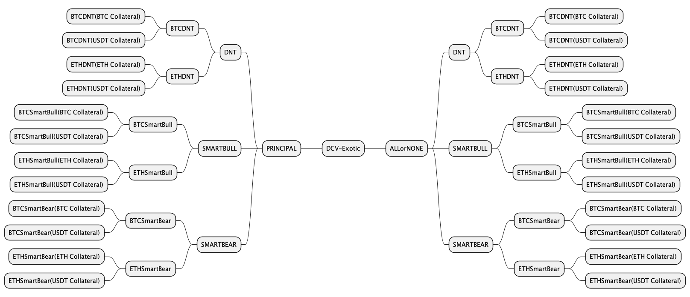

# Vault Classification

The Vault contract uses the ERC-1155 standard to **support fungibility of Position Tokens with the same strike price and expiry time**.  Tokens with different strike prices or the expiration time will have different Token IDs (ie. like a NFT) while still contained under the same Vault contract.

The SOFA protocol is designed with the flexibility **to support any structured product type and collateral denomination**, though a distinction will be made on whether the underlying product contains a 'principal protection' feature or not.  As such, our **Vault designs are split into 2 major, self-explanatory product categories called 'Earn' and 'Surge'**.

Example Vault Taxonomy at SOFA Launch

## Available Products at Launch

As our inaugural proof-of-concept, we will initially focus on three popular product structures called **'Rangebound' and 'Trend'**. Furthermore, all of these products are available in either Earn or Surge protocols.  Moreover, additional product types will be continually added based on user demand and ecosystem feedback.

## Rangebond Products

### Product Overview

Rangebound products are a type of structured product based on price boundaries. **Depositors can profit if the underlying asset does not touch the preset barriers during the maturity period**.  These products are suitable for users who expect the market to stay in a sideways consolidation phase with subdued volatility.

Referring to the payoff diagram below, a user believes that BTC will be stuck between a range as defined by the lower and upper barriers, but does not want to incur much downside even if the view proves to be wrong.  The Rangebound product will guarantee the user a minimum base yield of (A) even if the price of Range breaks out from either side, but the user will be entitled to an extra profit return equivalent to (A+B) should prices stay contained within the barriers.

For customization options, the **user is free to adjust the width of the price range, which would incur a different profile of base and upside profits depending on the levels chosen**.  Naturally, specifying a tighter price range represents a more aggressive bet on low volatility, which would lead to higher upside returns.  Conversely, a wider price range would lower excess profits in return a higher probability of winning.  Finally, for ease of management, the product can specified to be automatically 're-rolled' upon maturity as a continuation bet at a later protocol upgrade . (The 're-roll' function will be rolled out in the next phase of the upgrade).

## Trend Products

### Product Overview

The **Trend product is suitable for depositors who expect that the market will soon undergo a smooth and steady trend, but still desires some downside protection**.  By defining both a lower and upper price barrier, users will start accruing income gains as soon as the underlying instrument crosses the initial price threshold, with increasing payouts until we hit a maximum at the 2nd boundary.

Moreover, unlike the Rangebound product, the Trend product only observes at the time of settlement whether the price of the underlying asset falls within the set range to determine the final profit (ie. European option).  **This product is available via both Bullish and Bearish expressions**.

As an example, if a user is bullish on BTC and predicts that in the next seven days, the price of BTC will remain above $68,500 but will not exceed $71,500, they can choose to buy a Bull Trend product, setting $68,500 as the lower limit and $71,500 as the upper limit of the profit range.  Referring to the diagram below, at the time of settlement, the user will be eligible for a payout between base profit of (A) to and upper limit of (A+B), depending on what the price of BTC is at the time.

### Applicable Scenarios

The product might be **suitable for depositors who believe that an asset will see a strong reaction to a specific economic event, but is also concerned about the risk of a price decline should they be wrong** in their market prognosis.

For example, the user might desire to speculate on BTC prices on the next FOMC decision, the having event, or the next ETF approval announcement.  This strategy is **appropriate for users holding a strong market conviction into these important but risky events, and wants to remain disciplined in managing downside losses** should his/her view turn out to be wrong.

## Shark Fin (For Later)

### Product Overview

Compared to Rangebound and Trend products, the 'Shark Fin' product is relatively more well-known in TradFi markets thanks to its memorable moniker.  Its design and payoff are similar to Trend (ie. European option), with the **main exception being that the depositor is speculating much more aggressively on prices being within a particular range**.

Said in another way, the Shark Fin product **adopts a more conservative view on market volatility by sacrificing more upside on a large market move, in return for more aggressive profits within the lower price boundaries**.

As example, let's say an user is bullish on BTC, but holds a high conviction that it will not breach a certain upper bound at some strong technical resistance level.  In such a scenario, the user can choose to buy a Bullish Shark Fin product with a payoff profile as per the diagram below.  At product settlement, the user will receive a return ranging from (A) to (A+B) depending on where spot BTC is; however, unlike in Trend products, note that the return _drops_ to (A+C) upon a breach of the upper price barrier, offering a trade-off in exchange for more aggressive profits in the preceding range.

