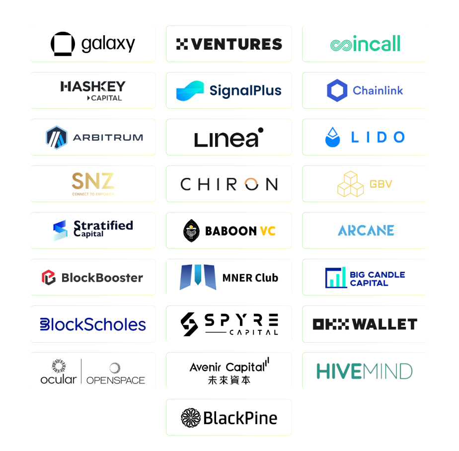

# 開發者文件

SOFA 協議是一個完全開放、包容且非營利的區塊鏈項目，**我們歡迎所有有才華的人士為 SOFA 生態系統的持續發展做出貢獻**。除了協議的核心鏈上結算和託管功能外，協議的所有其他方面都對任何人開放修改和改進。

這些方面包括前端介面、匹配服務，或通過我們的 dAPP 平台成為參與的做市商。**有價值的貢獻者有資格獲得 $RCH 空投獎勵**，詳情請參閱代幣經濟學部分。

請參閱以下開發者文件，以獲取有關如何連接我們協議的各種技術細節。我們期待在可預見的未來看到一個繁榮的 SOFA 社區。

