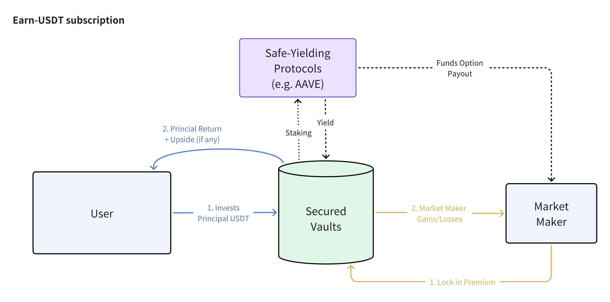

# 定義您的風險偏好

> **您希望承擔多少下行風險？**

## Earn 協議

'Earn' 協議類別專為尋求資本最大下行保護的風險規避型存款者設計。Earn 保險庫將**將用戶存入的資本質押在安全收益的協議中（例如 AAVE）以產生基礎利息**，並利用部分保證收入為市場做市商的期權溢價提供資金以獲得上行潛力。

最終結果將**最大化下行保護**，同時在市場朝用戶有利方向移動時仍保持一定的上行潛力。

需要注意的是，**一個關鍵的設計組件要求合資格質押協議提供的被動收益顯著高於產品的最壞情況支付，以便正確資助期權溢價以產生上行回報**。因此，如果用戶持有的是 ETH 而不是 USDT，他/她需要在像 Lido 這樣的流動質押協議中將 ETH 轉換為 stETH，然後將 stETH 鎖定在協議保險庫中以受益於額外的收益增值。

## Surge 協議

對於具有更高風險回報容忍度的用戶，**協議還提供具有前期資本“賭注”的高回報結構**。Surge 協議僅針對希望以資本損失換取極高回報的激進用戶。

在這些基於 Surge 的產品中，**協議保險庫將在交易開始時鎖定用戶的本金以及市場做市商的溢價，類似於某種“撲克賭注”**。鎖定的資本頭寸將_不_會被重新質押到其他協議中，並作為對最終支付的承諾賭注。

讓我們以 Surge-Rangebound 產品為例。如果標的資產的價格在最終到期時嚴格保持在障礙範圍內，用戶將獲得比 Earn 版本下更高的回報。然而，如果發生相反情況，結構將提前終止，鎖定的本金將轉移給市場做市商，作為此策略的“贏家”。

再次強調，**這些產品是為持有非常強烈市場信念的用戶設計的，他們希望通過測試這種信心來換取本金損失以獲得非常高的回報率。**

## PSA: 關於 Rangebound 產品的特別說明

Rangebound 實際運作的圖示說明

雖然理論上簡單，但 Rangebound 產品實際上存在一些設計挑戰，特別是在 DeFi 鏈上兼容性方面：

- 該產品參考的是一系列歷史價格，而不是到期時的“時間點”檢查。
- 如果價格障礙被突破，產品可能會被“淘汰”。
- 該產品可以在_任何一秒_被淘汰，但技術上不可能全天候不斷刷新鏈上價格參考。

  - 因此，範圍檢查是“回溯性”的。

團隊針對上述挑戰做出了以下設計妥協：

1. **每日範圍檢查：**

  - 為了考慮到 gas 費和鏈上 TPS，我們的 Rangebound 產品將僅進行_每日_價格檢查（在 OTC+8 的下午 4 點）以確定產品在過去 24 小時內是否被淘汰。
  - 被淘汰的產品將終止，未來不再有風險敞口。

2. **每日產品週期：**

  - 與每日範圍檢查和結算節奏一致，我們的觀察週期將始終從_下一個_4 點（OTC+8）時段開始。
  - 儘管如此，用戶可以隨時訂閱和購買 Rangebound 產品，他們的基礎+收益將立即開始累積。

3. **提前終止與最終提取：**

  - 被“淘汰”的 Rangebound 產品實際上是“遊戲結束”；然而，用戶的存款仍然質押在 Aave 中，我們必須等到最終到期才能讓用戶提取本金。