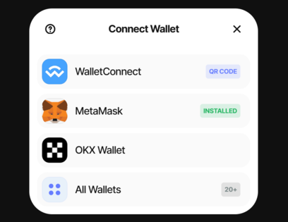

# 使用指南

## 準備您的錢包

如果您尚未安裝 Web3 錢包，請使用支持插件的瀏覽器，如 Chrome 或 Firefox，來安裝我們支持的錢包。

當您的錢包準備就緒後，直接導航到 [**SOFA APP**](https://earn.sofa.org/products) 並連接您的錢包。SOFA 支持以太坊和 Arbitrum。

## 在 Earn 和 Surge 協議上開始交易 📢

### 1. 定義您的風險偏好 ✅

#### **Earn 協議**

專為尋求資本最大下行保護的風險厭惡型存款者量身定制。

#### **Surge 協議**

設計為追求高回報的人士，Surge 協議非常適合願意承擔更高風險以獲得潛在更大回報的人。

### 2. 從您的市場洞察中獲利 ✅

在每個協議下選擇三種結構化產品，每種產品適合不同的市場條件：

#### 1) 區間波動

該產品非常適合無聊的橫盤市場！當波動性低且價格穩定時，用戶有更高的機會獲得吸引人的回報。

#### 2) 牛市趨勢

該產品非常適合預期市場持續上升的用戶。如果您對市場前景持樂觀態度，牛市趨勢就是為您量身定制的！

#### 3) 熊市趨勢

該產品非常適合預期市場持續下降的用戶。如果您對市場前景持悲觀態度，熊市趨勢就是專為您設計的！

**現在，選擇並交易與您的風險偏好和市場觀點相匹配的 SOFA 產品！**