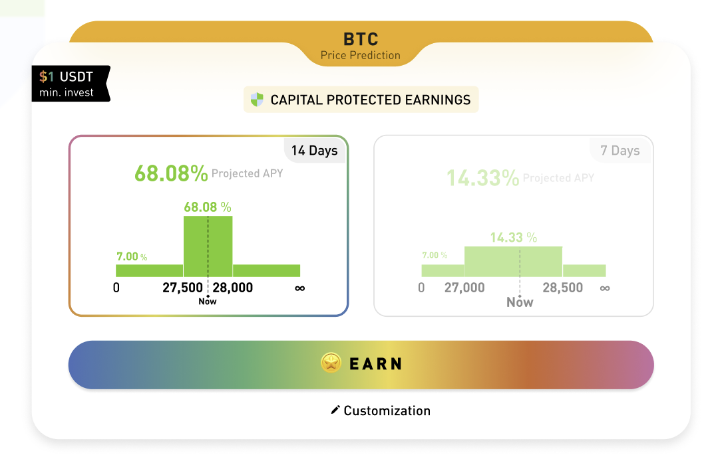
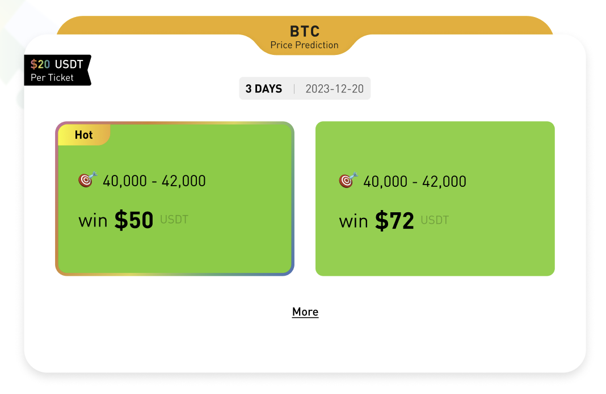

# Vaults

得益于 Sofa.org 协议的精心设计，理论上我们可以支持任意类型任意抵押物的结构化产品。

目前推出的产品从类型上可分成 Double No Touch 和 Smart Trend 两种，后续将会推出更多类型。

从投资偏好上又可分为高收益型和保本型，其中保本型产品会将用户的本金投入到 AAVE 等协议中生息，并用利息的一部分与做市商进行对赌。

在上述分类标准基础上，不同的标的物和抵押物相组合生成不同的 Vault 合约。

## 按照产品类型分类

### Double No Touch (DNT)

Double No Touch 产品是一类基于价格边界的结构化产品。投资者可以在投资期内从未触及到预设的价格高点或低点中获利。这类产品适合预期市场将处于特定价格范围内、波动性较低的投资者。

### Smart Trend (趋势智赢)

Smart Trend 产品则是适合预期市场将处于单边行情。它也具有和高点和低点两个预设的价格。通过申购产品，您可以预测行情，并在价格向您预测的方向发展时享受增强收益。

## 按照风险偏好分类

### 保本型

保本型产品则是为风险规避型投资者设计的。用户的本金将被投资于如 AAVE 这样的知名协议，以稳定的利息收入为基础，实现资产的安全增值。利息的一部分用于与做市商进行对赌，旨在在保证本金安全的同时，获取额外的收益潜力。

### 高收益型

对于风险承受能力较高、追求最大化回报的投资者，我们提供高收益型产品。这些产品在可能带来较高回报的同时，也承担着相应的风险。

