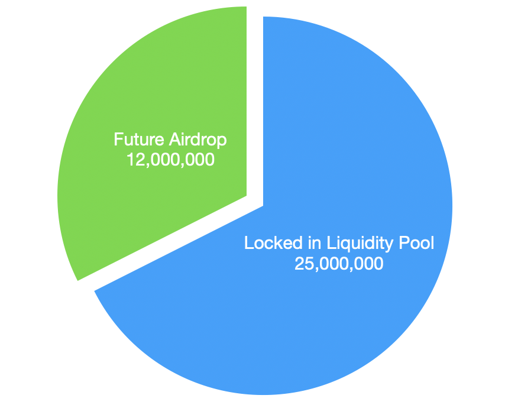

# $RCH

RCH 是 Sofa.org 生态最重要的代币，作为承载了整个生态价值的代币，RCH 将会实现彻底的 fair launch，没有任何的预售，也没有给团队或者投资人预留任何的份额。获得 RCH 的唯一途径就是在 sofa.org 的生态协议里进行更多的交易。

Sofa.org 通过 RCH 创造了一个全新的去中心化清算体系及经济机制，把生态未来所有潜在的收益都分享给交易者：

## RCH 的本质：利用通缩来存储交易的价值

1. RCH 总量只有 37,000,000（3700 万）个
2. sofa.org 生态内产生的手续费都会全部用于在 Uniswap 的 LP 里购买 RCH 并且直接 Burn 掉。随着交易越来越多，RCH 的总量就会越来越少，RCH 变得越来越稀缺。**这样就让每一笔交易的价值都经由通缩被存储到了剩余的 RCH 里**，使得每一个剩余的 RCH 代币的价值持续并永久地上升。
3. 得益于供给短缺且持续通缩的特性，随着 Sofa.org 生态各个协议交易量的上涨，RCH 价格将快速上涨

## 如何获得 RCH

每天都会有一定数量的 RCH 作为奖励空投给所有参与交易的人，交易量更大的人可以收到更多的 RCH，把交易的价值返还给交易者

$$
\text{Daily RCH airdrop for a trader}=\dfrac{\text{Daily trading volume made by him/her}}{\text{Total daily trading volume }}\times \text{Daily RCH airdrop distributed to all traders}
$$

## RCH 代币经济

### 基础金库

超过 60% 的 RCH，25,000,000（2500 万）个 RCH 一开始就被预挖出来，和价值超过 500000 美元的 ETH 共同放到以太坊的 Uniswap L3 里形成最初的 Liquidity Pool，这部分 RCH 和 ETH 被称为**基础金库**。

**基础金库不属于任何人，存完 LP 后会直接把相关 uniswap LP token 销毁**，确保基础金库的流动性永远不会被提走。这意味着市场上未来可能新增的 RCH 远少于被锁在 LP 里的，RCH 价格几乎不可能低于初始价格。

### 给交易者的空投奖励

总量 12,000,000 个的 RCH 将按照计划空投给生态的交易者。

刚开始每天有 12500 个 RCH 空投给 Sofa.org 生态的交易者，每日空投的数量逐渐变少，每隔 180 天减少 20%。

| **Days after launch** | **Daily Airdrop** |
| --------------------- | ----------------- |
| 0                     | 12,500            |
| 180                   | 10,000            |
| 360                   | 8,000             |
| 540                   | 6,400             |
| 720                   | 5,120             |
| 900                   | 4,096             |
| 1080                  | 3,276.8           |
| ……                  | ……              |

## RCH 具有强大的抗风险能力和反周期能力：

### 来自整个生态的正向循环

RCH 币价越高，在 sofa.org 生态交易可以获得的空投价值越高，从而促进 sofa.org 的交易量提高；而随着交易量越大，Burn 掉的 RCH 越多，RCH 的币价就会越高。

### 天然的抗波动能力

RCH 是完全的 fair launch，没有任何人或者团队在初始时刻持有 RCH，不会出现突然的大户进行抛售；

基础金库的流动性被锁死不会撤走，不会流动性枯竭；

只要 sofa.org 有交易就会无限通缩；

币价下跌时，交易的美元手续费会买到更多的 RCH 并且 burn 掉，加速减少 RCH 的数量，稳定币价；

## 无限扩展的生态

未来满足 sofa.org 标准的 true Defi 项目都可以申请加入 sofa.org 生态。

### 加入生态的好处

1. 获得 sofa.org 的 true defi 认证和推广
2. 项目内的交易也可以获得 RCH 空投

### 加入生态的要求

1. 满足 true defi 标准
2. 将项目的全部或者一部分手续费用于 Burn RCH
3. 通过 SOFA 持有人的集体投票

随着加入 sofa.org 生态的协议越来越多，会有更多的交易手续费被用于 Burn RCH 提高其币价，从而使得所有生态协议的交易者都获得更高的回报。

通过 RCH，sofa.org 建造了一套完全中立的代币体系来为交易者和做市商服务，把交易创造的所有价值都通过 RCH 的方式回馈给每个参与交易的交易员。我们相信这个体系将为 true web3 的金融交易奠基，成为未来 web3 金融体系不可或缺的一部分。
