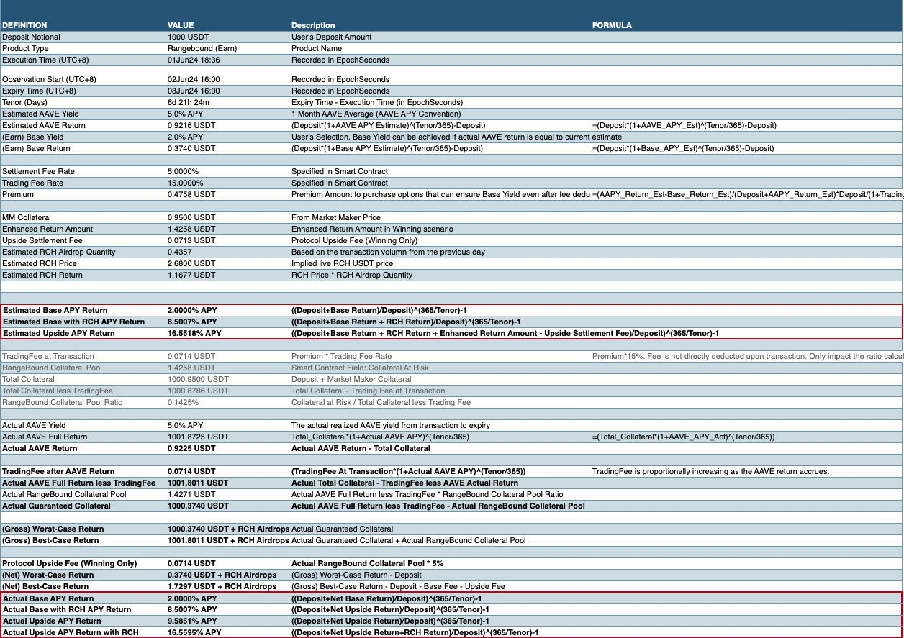

# 协议费用

在 SOFA，我们致力于创建一个公平透明的金融生态系统，让用户能够以民主的方式从做市商那里购买各种结构化产品，价格透明且公平。此外，**作为一个完全去中心化的项目，我们希望确保任何协议收益主要与我们的基础用户共享**，确保完全的激励一致性，而不是向特殊利益群体提供特权支付。因此，我们设计了一系列费用结构，**采用“公平启动”的代币经济学，以确保适当的价值积累并支持平台的长期寿命**。在 SOFA 内不会有风险投资的短期获利或退出流动性抛售。

## 协议费用

> 💰 SOFA 将收取用户期权溢价的 15% 作为基础交易费。此外，如果用户获得“赢得”支付，将对总的毛收益支付收取额外的 5% 结算费。

## 费用计算

为确保完全透明，请参阅以下示例，了解我们协议中费用和收益的计算方式。

**定义：**

$$Premium = Notional_{Deposit} * (1 + AAVE_{1MonthAverage} - BaseYield)^{Full Days/365} - Notional_{Deposit}$$

_MM's Collateral = 做市商的保险库锁定抵押品_

**观察窗口：**

从_下一个 16:00（UTC+8）到到期日 16:00（UTC+8）_

**到期时用户收益：**

1. 如果触发敲出

    $$Payoff_{inUSDT} = Notional_{Deposit} + AAVEInterest_{Actual} - Premium * (1 + 0.15)$$

2. 未触发敲出

    $$Payoff_{inUSDT} = Notional_{Deposit} + AAVEInterest_{Actual} + Premium * (1 - 0.15 - 0.05) + MM'sCollateral * (1 - 0.05)$$

### 数值示例（区间限制）

### 分配瀑布图（USDT）

### 原生代币 ($RCH) 回购

> **将协议成功与代币表现对齐**

在 SOFA，我们相信**最直接的方法是通过代币回购来对齐用户和持有者的激励**，而 $RCH 是我们的原生实用代币。我们将**承诺将所有协议收入专用于 $RCH 回购**，从而创建一个由协议使用推动的代币价格上涨的良性循环。

由于**固定的通缩供应、系统化的释放计划和使用驱动的空投，$RCH 的长期价值增值很大程度上取决于协议收入**，而这本身就是采用成功的直接衡量标准。此外，随着**代币空投仅限于协议用户和支持者**，我们可以确保他们能够从 SOFA 的长期成功中获得最大收益，忠实于 DeFi 的商业理想，即“回馈”真正的核心用户和早期采用者。

**代币回购逻辑是 SOFA 协议智能合约的一个重要组成部分**。协议管理员将定期触发此过程，通过支持的 DEX 场所使用协议收入购买并销毁 $RCH。被销毁的 $RCH 将不再进入流通，并且随着协议使用量的增加，$RCH 的总量将逐渐减少。

我们代币经济模型的更多细节将在下面专门的章节中介绍。
